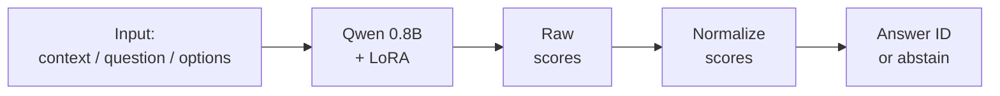

# Reflex

Reflex explores classification, routing, and tool selection: can a compact model choose
from **2–16 options supplied at runtime** in one model pass, without a text-generation
loop? Experiments use Qwen3.5-0.8B-Base and a learned adapter over a frozen base.

**Status:** research prototype.

## How a decision is scored

Each request contains a context, a question, and a closed set of options with stable
IDs. The model scores candidate answer symbols, which are mapped back to those IDs. No
answer is generated token by token.



LoRA (Low-Rank Adaptation) adds small learned matrices to a model while its original
weights stay frozen. A **logit** is a raw score for one candidate. Normalization turns
the candidate scores into values that sum to one over the supplied options, but does
not make them calibrated probabilities of correctness.

The scorer supports abstention on ties and an optional minimum-confidence threshold.
Related approaches are described in the [runtime decisions design note](docs/adr/0001-runtime-decisions.md).

### Illustrative input

This small example shows the request shape only. It is not an inference result.

```json
{
  "context": "The package arrived after noon.",
  "question": "Was it delivered in the morning?",
  "options": [
    {"id": "yes", "label": "Yes"},
    {"id": "no", "label": "No"},
    {"id": "unknown", "label": "Not enough information"}
  ]
}
```

## What the project contains

- A strict request and record schema with stable option IDs, split metadata, and hashes
  for request provenance.
- Deterministic prompt rendering and checks that each candidate symbol is one token at
  the prompt boundary.
- Candidate scoring, normalization, tie handling, optional abstention, and offline
  evaluation metrics.
- Synthetic task generation with labels computed by deterministic programs, source
  groups, and auditable records.
  Synthetic fixtures exercise the tools; they are not benchmark evidence.
- Grouped split checks and evaluations that compare original and changed answer orders.
- Explicit cloud runbooks for model checks and LoRA experiments, with saved checkpoint
  reload checks and recorded run evidence.
- Independent recounts and structured verification receipts for key studies.

The CPU package validates records and evaluates supplied predictions. It does not load
Qwen, run inference, train weights, or fit calibration parameters. Synthetic records
support data generation and controlled training studies; the fixtures used by the
quickstart are not benchmark evidence. See the [CPU foundation](docs/cpu-foundation.md)
and [synthetic data plan](docs/synthetic-data-plan.md).

## Selected research results

A point means one percentage point.

### Evaluation on new public questions

The selected adapter and fresh base were compared on 700 public questions, each shown
in its original order and with answer positions shifted once. Table counts average those
two paired views; the doubled denominators do not mean more independent questions.

Exact-match checks found no overlap with the adapter's 1,504 training records.
Paraphrase overlap or exposure during base pretraining is unknown.

| Task | Questions | Qwen base | Selected adapter | Change in points (95% range) |
| --- | ---: | ---: | ---: | ---: |
| Sentence logic (HANS) | 300 | 50.7% | 64.2% | +13.5 (−0.2 to +26.7) |
| Commonsense (WinoGrande) | 200 | 49.3% | 51.5% | +2.3 (−3.0 to +7.3) |
| Science (ARC-Challenge) | 200 | 52.3% | 68.5% | +16.3 (+10.8 to +21.8) |

The science interval excludes zero on this sample. The sentence logic and commonsense
intervals include zero, and WinoGrande accuracy remains near chance. See the [full
evaluation and limits](docs/fresh-eval-results.md).

### A development result and a later training tradeoff

On 192 SNLI development questions shown in six answer orders, a human labeled practice
run scored **86.46% (996/1,152)**, compared with **66.75% (769/1,152)** for its matched
synthetic practice control. All nine predefined checks passed.

The SNLI questions were from a source also used in training, so this is a development
measurement on a known source, not evidence of held-out reasoning or general
performance. This run's adapter, `snli_mix` at update 378, remains selected. See the
[SNLI results](docs/natural-reasoning-results.md).

The later study compared three training states on HANS and WinoGrande questions
reserved for that study, plus earlier skills. These HANS and WinoGrande questions differ
from the 700-question sample above. Each was tested in two answer orders.

| Task | Earlier selected adapter | More earlier practice | New targeted practice |
| --- | ---: | ---: | ---: |
| Sentence logic (HANS) | 63.3% | 71.7% | 88.3% |
| Commonsense (WinoGrande) | 54.0% | 51.0% | 63.3% |
| Science (ARC) | 67.8% | 66.5% | 62.0% |
| Reading (BoolQ) | 78.1% | 76.6% | 71.9% |
| Cause and effect (COPA) | 90.6% | 85.9% | 71.9% |

Against more earlier practice, HANS improved by 16.7 points and WinoGrande by 12.3
points; both paired 95% ranges were above zero. Supported HANS claims fell from 94.7% to
80.3%.

Only 19 of 24 fixed checks passed, so keep the earlier selected `snli_mix` adapter at
update 378. The study had one training seed and a controller interruption; see the
[targeted training results](docs/targeted-training-results.md) for the recovery record
and independent recount.

These findings are selected results, not an overall reasoning score. Earlier reports
retain the failed real-data pilot, prior-art comparisons, training controls, and other
tradeoffs. The [research summary](docs/research-summary.md) brings the full experiment
history together; individual [results](docs/) and [verification
receipts](docs/verification/) provide study-level detail.

## What remains open

- **Answer order:** the adapter still changes some answers when choices move, and fewer
  answer changes do not ensure correctness.
- **Generalization:** the samples are small and partly inspected during development.
  Broad transfer to new task families is unproven; pretraining overlap is unknown.
- **Calibration and abstention:** scoring code exists, but calibrated correctness
  probabilities and abstention behavior suitable for release have not been established.
- **Speed and cost:** no comparison on a fixed protocol has established latency or cost
  advantages for each request.
- **Larger models:** a 4B-model evaluation is a possible future study; it has not been
  run.

## CPU quickstart

Requires Python 3.12 or newer and [uv](https://docs.astral.sh/uv/). These commands use
the synthetic fixture included in the repository. They need no model weights, account,
GPU, or access to a model service.

```sh
uv sync --locked --dev

uv run reflex validate \
  --records data/fixtures/records.jsonl \
  --manifest data/fixtures/manifest.json

uv run reflex evaluate \
  --records data/fixtures/records.jsonl \
  --manifest data/fixtures/manifest.json \
  --predictions data/fixtures/predictions.jsonl \
  --output /tmp/reflex-fixture-report.json
```

The fixture contains synthetic records and synthetic logits. This quickstart checks data
formats, split lineage, joins, and metrics; it does not run a model or reproduce any
result above. The evaluator writes a report with hashes of its input files. See the [CPU
guide](docs/cpu-foundation.md) for schemas, metrics, and limitations.

## Repository guide

- `src/reflex_decisions/` — request schema, prompt rendering, scoring, and evaluation
  code.
- `experiments/` — model checks, training runners, evaluation scripts, and analysis.
- `data/fixtures/` — synthetic records and logits for the CPU quickstart.
- `data/` — manifests, recipes, and data notices; benchmark source records and model
  weights are not bundled here.
- `docs/research-plan.md` — current research question, boundaries, and next-step
  criteria.
- `docs/research-summary.md` — complete experiment history and synthesis.
- `docs/*-results.md` — detailed study findings and limits.
- `docs/verification/` — structured receipts and independent checks.
- `docs/adr/` — design decisions and their evidence.

## Data and licensing

Experiments reference SNLI, BoolQ, COPA, HANS, WinoGrande, ARC-Challenge, DBpedia-14,
and SMS Spam, alongside self-authored synthetic examples. Source revisions, attribution,
and terms are recorded in the [SNLI notice](data/notices/SNLI-DATA-NOTICE.txt), [BoolQ
notice](data/notices/BOOLQ-DATA-NOTICE.txt), [COPA license record](docs/licenses/copa.txt),
the [HANS](docs/licenses/fresh-eval-hans.md), [WinoGrande](docs/licenses/fresh-eval-winogrande.md),
and [ARC](docs/licenses/fresh-eval-arc.md) notices, and the [DBpedia-14 and SMS Spam
pilot notices](docs/licenses/real-pilot-sources.md). Dataset terms apply independently
of this repository.

No model weights are released. The repository has no top-level code license, and a public
model release remains future work.
