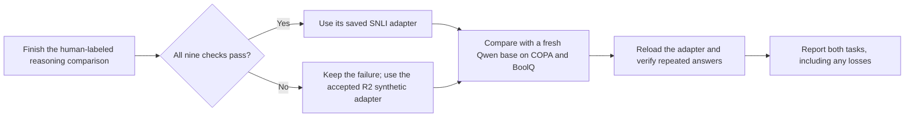

# Check whether the adapter helps on other tasks

**Plan fixed on:** 2026-10-05. No transfer run has started.

This check asks whether the saved adapter helps on cause-and-effect questions
(COPA) and yes/no reading comprehension (BoolQ). These examples were excluded
from adapter training. We have used these small development panels before.
They are not sealed tests. Base-model pretraining overlap is unknown.

## Select the adapter before scoring

Use `snli_mix` from `natural-reasoning-2026-10-04-r1` only if execution,
independent result checks, remote storage checks, and all nine predeclared
learning checks pass. Otherwise use the accepted `synthetic_mix` adapter from
`mixture-2026-10-04-r2`. Preserve any failure in the new comparison.

Do not choose between R1 and R2 based on transfer scores. Do not change the
selected adapter, prompt, examples, or settings after this evaluation starts.
Record the exact training receipt, analysis, and saved-file hashes in a
separate selection record before launch. The selected
checkpoint is the final checkpoint only: update 378 for the new candidate,
or update 252 for the R2 synthetic adapter.

## Use the existing panels

| Task | Questions / source groups | Orders per question | Primary score |
| --- | ---: | ---: | --- |
| COPA: cause and effect | 32 / 32 | Original and reversed | Correct out of 32, original order |
| BoolQ: reading comprehension | 32 / 32 | Original and reversed | Correct out of 32, original order |

The COPA processed-record hash is
`a8daefa5a7300cc6243f3af1208bbd2887d41c306416bb37bf95263748657c5b`.
The existing BoolQ-plus-SNLI bundle hash is
`5d09ac1c1df2b7c1849e675179cb57306040f473c0ebad60527f54d186ac6845`.
Select only BoolQ from that bundle. Check the accompanying manifests and
source revisions. Verify no record ID, source group, or exact semantic request
overlaps the approved adapter-training pools. Never open sealed-test data.

Preserve canonical option IDs when reversing choices. Send only requests and
identities to the GPU worker. Keep answer labels on the CPU for later scoring.
Hash the exact panel and source files before launch. Reject missing or changed
pins, duplicate rows, unsupported fields, and any request longer than 2,048
tokens. Do not truncate text.

## Compare under the same conditions

Use the pinned Qwen3.5-0.8B-Base revision
`dc7cdfe2ee4154fa7e30f5b51ca41bfa40174e68`, the existing BF16 base loader,
FP32 LoRA weights, tokenizer, prompt renderer, candidate-token scorer, and
pinned runtime packages. Disable training and gradients. Verify the saved
adapter files before loading them. Compute the tensor digest from the verified
saved file. Check loaded tensor names, shapes, and values against that file
before scoring. Record the digest and require it to match on fresh reload.

Score a fresh base and the selected adapter on all 128 presentations each.
Then load the adapter again from disk on a fresh base. Repeat both orders for
the first four sorted record IDs in each task: 16 extra presentations. Require
exact adapter tensors, identical tokenization and winners, and maximum
candidate-score difference at most `0.001`.

| Work | Model forwards |
| --- | ---: |
| Fresh base | 128 |
| Selected adapter | 128 |
| Fresh reload checks | 16 |
| **Total ceiling** | **272** |

The input-token ceiling is **557,056**. Record actual counts. Use one single-use
A10 worker, two CPU cores, 16 GiB memory, a 900-second function timeout, and a
300-second startup timeout. Use zero retries, no warm workers, and a two-second
scale-down window. Check the personal Modal account before launch. An estimate
from these time limits is not a dollar ceiling.

Keep this evaluation separate from the frozen 4,023-presentation training
contract. Reuse the existing loader, scorer, and output validator. Do not
change their behavior or repin historical results.

## Report the result without selecting a winner afterward

For each task, show base and adapter original-order counts and percentages.
Also show accuracy across both orders and how often reversing choices changes
the selected answer. Treat the two orders as views of one question.

For each task separately, compute paired adapter-minus-base differences for
original-order accuracy and average accuracy across both orders. Use exact
fractions and 2,000 paired source-group bootstrap draws, seed `20261009`.
Process task IDs and group IDs in sorted order. Use the same draws for both
comparisons within each task. Use type-7 interpolation for the 95% interval.
Do not combine the tasks into a single headline score or count orders as
independent examples. Do not fit temperature or tune confidence thresholds.

Validate all output identities, finite scores, token counts, prompt hashes,
winner rules, forward totals, and reload evidence. Recount results independently.
Record failed execution and partial evidence without converting it into a pass.
Confirm the app has stopped after completion. No weights may be downloaded
to the laptop.

These measurements have no new learning threshold. Report gains and losses.
They cannot reverse a failed training check or establish broad superiority.
Earlier Intern and Kev scores may be shown as clearly labeled context only
after validating their saved evidence. Their runtime and precision differ.
BoolQ is a disclosed Kev training source; overlap with these rows is unknown.

Retain COPA's BSD-2-Clause notice and BoolQ's CC BY-SA 3.0 notice. Keep results
and adapters in the private personal project. This plan does not authorize a
public model release.
