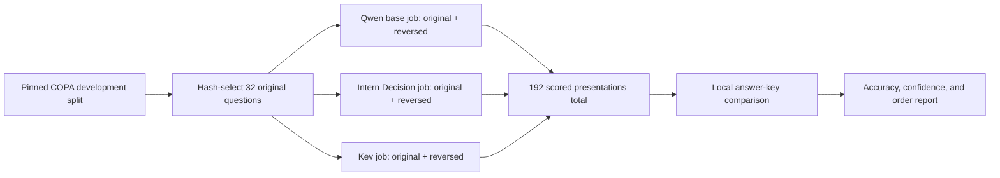

# COPA development baseline protocol

**Status:** Frozen for a development-only comparison. No model evaluation is reported here.

## Dataset and recipe

Use only the upstream COPA development split from [Andrew S. Gordon's pinned author page](https://github.com/asgordon/asgordon.github.io/blob/14496936a3bed7b386aa8f517656d6f91e3fa77a/copa.html), revision `asgordon/asgordon.github.io@14496936a3bed7b386aa8f517656d6f91e3fa77a`, archive path `downloads/COPA-resources.tgz`, member `COPA-resources/datasets/copa-dev.xml`. The source describes 500 development and 500 test questions and directs researchers to reserve test for final evaluation. COPA is described in Roemmele, Bejan, and Gordon, “[Choice of Plausible Alternatives: An Evaluation of Commonsense Causal Reasoning](https://github.com/asgordon/asgordon.github.io/blob/14496936a3bed7b386aa8f517656d6f91e3fa77a/publications/AAAI-SPRING11A.PDF),” AAAI Spring Symposium, 2011. The license is BSD 2-Clause; see [the required notice](licenses/copa.txt). The committed manifest is [copa-dev-manifest.json](../data/baselines/copa-dev-manifest.json).

| Artifact | SHA-256 |
|---|---|
| Pinned source archive | `5145348834d2081ad90da0397d1db3d70fa044e506bd8ce224194d24b04cdbbe` |
| Development XML member | `6251d7d99de4cbc6a2c3323923213e5e73071d286039b97a0908736e2be093bc` |
| Canonical 32-record JSONL | `a8daefa5a7300cc6243f3af1208bbd2887d41c306416bb37bf95263748657c5b` |
| Canonical manifest JSON | `4e60e82ea1622d4e069b4244aa596db64cafa03bdb9ec85d3c4d06d2c40e7635` |

Select 32 unique items from the 500-item development XML by sorting all development IDs on `SHA256("reflex-copa-pilot-v1:" + original_id)`, independent of labels. Write them to `data/processed/copa-dev-pilot-v1.jsonl`, preserving source IDs, original option order, semantic IDs `choice1`/`choice2`, and labels. The runner presents each item once in original order and once reversed, remapping scores back to semantic IDs. The correct answer key stays local and is never sent to a model.

Acquire the pinned archive and verify it before extraction. Extract only the named development member; do not unpack the other archive members:

```sh
mkdir -p data/raw
curl -fL 'https://raw.githubusercontent.com/asgordon/asgordon.github.io/14496936a3bed7b386aa8f517656d6f91e3fa77a/downloads/COPA-resources.tgz' -o data/raw/COPA-resources.tgz
shasum -a 256 data/raw/COPA-resources.tgz
python3 - <<'PY'
import hashlib
import tarfile
from pathlib import Path

archive = Path("data/raw/COPA-resources.tgz")
expected = "5145348834d2081ad90da0397d1db3d70fa044e506bd8ce224194d24b04cdbbe"
if hashlib.sha256(archive.read_bytes()).hexdigest() != expected:
    raise SystemExit("COPA archive SHA-256 mismatch")
with tarfile.open(archive, "r:gz") as source:
    member = source.getmember("COPA-resources/datasets/copa-dev.xml")
    if not member.isfile():
        raise SystemExit("COPA development member is not a regular file")
    stream = source.extractfile(member)
    if stream is None:
        raise SystemExit("COPA development member could not be read")
    Path("data/raw/copa-dev.xml").write_bytes(stream.read())
PY
shasum -a 256 data/raw/copa-dev.xml
uv run python experiments/prepare_baseline_data.py
```

The preparation command reads local pinned inputs only; it never downloads or extracts files. It checks the archive/member hashes and source revision, validates the complete XML, rejects normalized exact duplicates, creates the deterministic sample, validates it with the strict loaders and `audit_splits`, checks the committed recipe hashes, and refuses to overwrite an existing output. Raw and processed data live under ignored `data/raw/` and `data/processed/` paths.

## Model pins and controls

| Baseline | Evaluated model revision | Inference path and temperature |
|---|---|---|
| Qwen base | `Qwen/Qwen3.5-0.8B-Base@dc7cdfe2ee4154fa7e30f5b51ca41bfa40174e68` | Raw candidate scores, `T=1`; no published calibration temperature |
| Intern Decision | `internlm/Intern-Decision-0.8B@85a0cc5a99d67ea8d56dfe98115689212867171d` | Official shipped path at published `T=2.747760550703`, plus raw scores at `T=1`; its published preset uses XTuner, so this temperature is not validated or refit for the Hugging Face runtime in this pilot |
| Kev | `jaredpalmer/kev-0.8b@9a45d25eb2ab761841196625383fa1dff0e56c1e` | Official checkpoint calibration from loaded metadata (expected approximately `T=2.35`), plus raw scores at `T=1`; its base is the pinned Qwen revision above |

Kev's later card-only revision `bf75a6a8848ea6960ff2ed108d9ed44c2941174f` reports a more precise temperature (`2.3511`) without changing the released weights. The evaluated model revision remains the immutable weight release `9a45...`; record the actual temperature loaded from the checkpoint metadata. Do not substitute a card value if runtime metadata differs.

Use FP32, eager attention, and no inference cache for all three models. Enforce a 2,048-token maximum and reject overlong inputs without truncation. Use the pinned official inference templates and scoring implementations; do not tune prompts or temperatures on this sample. Derive raw and calibrated probabilities from the same returned logits so temperature variants do not add prediction forwards. Keep logits, probabilities, and semantic option IDs in the original request order when writing receipts.

## Scoring and reporting

Each model scores 32 original questions in two option orders: 64 scored presentations per model and 192 total across the three models. A few loader/calibration parity probes may add forwards beyond those 192 predictions and must be recorded separately. The local evaluator joins predictions to the protected answer key. Canonical metrics use only the 32 original-order rows, for both raw `T=1` and shipped-temperature paths:

- accuracy, macro-F1, NLL, Brier score, ECE, and risk-coverage/AURC;
- paired semantic forced-choice flip rate and Jensen–Shannon divergence between each original/reversed score pair, plus reversed-order accuracy as a separate order-robustness result.

Treat the 32 source questions as the independent units. Report the canonical 32-row count and paired item counts; do not treat the 64 presentations per model as 64 independent examples or average the reversed rows into canonical confidence metrics. Temperature changes confidence metrics, not the argmax. This fixed pilot changes no prompts, checkpoints, temperatures, or thresholds; future hypotheses may use development evidence.



The COPA source is reserved for Reflex development; this does not reserve or test the full causal reasoning task family. Kev's public supervised-source list does not name COPA, but exposure in base-model pretraining cannot be ruled out. Report training overlap as unknown; make no unseen-family or unseen-by-model claim.
