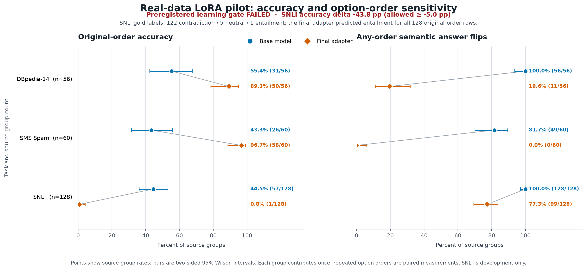

# Real-data LoRA pilot results

**Run:** `real-pilot-2026-10-04-r2` · **Status:** runner passed; preregistered learning gate failed.

The adapter improved original-order accuracy on DBpedia-14 and SMS Spam, and sharply reduced their sensitivity to option order. It failed the preregistered SNLI non-regression requirement: SNLI accuracy fell by 43.75 percentage points, from 44.53% to 0.78%. The overall learning gate therefore failed. These results describe this small, selected development panel; they do not establish broad or unseen-data superiority.

## Results

Accuracy is scored on the original option order. Each source group contributes once. Intervals are two-sided 95% Wilson intervals over source groups.

| Task | Source groups | Base accuracy | Final adapter accuracy |
|---|---:|---:|---:|
| DBpedia-14 | 56 | 31/56, 55.4% (42.4%–67.6%) | 50/56, 89.3% (78.5%–95.0%) |
| SMS Spam | 60 | 26/60, 43.3% (31.6%–55.9%) | 58/60, 96.7% (88.6%–99.1%) |
| SNLI | 128 | 57/128, 44.5% (36.2%–53.2%) | 1/128, 0.8% (0.1%–4.3%) |

The next table counts source groups whose semantic top answer changed under at least one tested option order.

| Task | Base | Final adapter |
|---|---:|---:|
| DBpedia-14 | 56/56, 100.0% (93.6%–100.0%) | 11/56, 19.6% (11.3%–31.8%) |
| SMS Spam | 49/60, 81.7% (70.1%–89.4%) | 0/60, 0.0% (0.0%–6.0%) |
| SNLI | 128/128, 100.0% (97.1%–100.0%) | 99/128, 77.3% (69.4%–83.7%) |

DBpedia/SMS macro accuracy rose from 49.35% to 92.98%, a +43.63 pp change (paired source-group bootstrap 95% interval +33.51 to +53.15 pp; 2,000 replicates, seed `20261005`). Their macro semantic-flip rate fell from 90.83% to 9.82%, an 89.19% relative reduction. SNLI accuracy changed by -43.75 pp (paired source-group bootstrap 95% interval -52.34 to -34.38 pp), below the preregistered -5.00 pp non-regression limit. The progression gate passed its DBpedia/SMS accuracy and order-stability components but failed its SNLI component.

SNLI's selected gold labels were 122 contradiction, 5 neutral, and 1 entailment; the final adapter predicted entailment for all 128 original-order rows. A metadata-only audit found that all 128 selected representatives were also the lexicographically lowest `pairID` in their same-caption rows, and 124 of those 128 caption sets contained mixed gold labels. The selected-label versus most-common same-caption raw-row-label counts were: contradiction→contradiction 49, contradiction→entailment 32, contradiction→neutral 41, entailment→entailment 1, neutral→entailment 1, and neutral→neutral 4. Pair IDs had four-character suffix tokens; their final character was `c` for the 122 contradiction and 5 neutral selections, and `e` for the one entailment selection. These are signs of selection bias, not a target distribution or a definitive causal explanation for the model's behavior. Exact source groups also union normalized premises.

## Run and verification evidence

The runner completed 252 optimizer updates and 1,008 training forwards. It recorded 2,572 base evaluation forwards, 2,572 final evaluation forwards, and 32 fresh-reload parity forwards, for 6,184 total. All 120 adapter tensors changed, and base-model gradients were absent. On the 32 parity presentations, adapter tensor keys, shapes, and values matched; winners matched and maximum absolute logit difference was 0.0. This is a 32-presentation parity check, not full-evaluation reload parity.

The storage verifier passed and confirmed that stored progress matched the runner receipt. It verified the adapter config and README contents; for safetensors weights it checked the path and size only and did not reread the bytes. Keep adapter weights and full per-presentation outputs private. Both Modal apps were stopped with zero tasks after the run. The current October Modal billing summary is workspace-wide and cannot be attributed to this pilot; it may lag recent usage.

Run R1 is excluded from quality results. It was an infrastructure failure: it made 2,572 base forwards, performed no training, hit a rejected hardlink save, and no output arrays were persisted.

## Calibration

Temperature fitting used 116 calibration rows and an 82-candidate grid. The base temperature was 0.921587 (raw/fitted calibration NLL 1.253614/1.251930); the final temperature was 1.672640 (0.503486/0.375419). These values are calibration-pool fit diagnostics, not held-out performance estimates.

## Scope and limitations

- SMS text has not received a privacy review. Do not publish raw SMS text or per-presentation outputs.
- DBpedia carries ShareAlike/GFDL obligations; review those obligations before redistributing derived data or artifacts.
- SNLI is development-only and has related prior exposure. No sealed-test or contamination-free claim is supported.
- The panel is small and selection-sensitive. Do not rebalance it or alter the frozen panel to improve this result; evaluate any new proposal on separately specified data.

## Reproduction record

The pinned protocol, manifest, recipe, and records SHA-256 values are recorded in [`docs/verification/real-pilot-summary.json`](verification/real-pilot-summary.json). R2 analysis, runner receipt, storage verification, and teardown/billing evidence are retained locally under `artifacts/` with their digests in that summary. Source commits were `3ae6803483b0a6a07643761ecea35a788c36fc7c` and storage fix `decfb196c7b049ebbe37a0521fe8cda513271c8f`; the latter was GitHub-verified and its CI run [37258429035](https://github.com/1337mus/reflex/actions/runs/37258429035) passed on that exact head. The local CI capture for the first commit reported Ruff checks and 250 tests passed. The analysis and receipt measured source-file maps matched exactly across all 17 files (16 Python files and the protocol).
