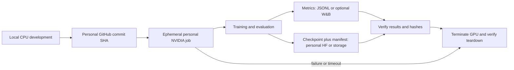
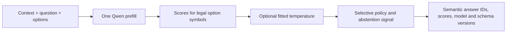

# Reflex v0.1 research and execution plan

**Date:** 2026-10-04

**Status:** CPU foundation, the Qwen compatibility smoke, the frozen 32-item COPA pilot, the 64-record BoolQ/SNLI development comparison, and the bounded synthetic training-mechanics rehearsal completed on 2026-10-04. The rehearsal memorized its own fixture and passed adapter reload checks; it is not real-data accuracy, benchmark, or generalization evidence. No Reflex advantage or broad benchmark has been established, and provider billing remains unverified. The next step is to preregister a small real-data multi-task pilot with holdouts before scaling.

**Purpose:** Decide whether a small model can make useful runtime-defined decisions in one forward pass, and whether Reflex can demonstrate a defensible contribution against existing decision models.

## 1. Research question and evidence boundary

The initial question is not whether one can read candidate logits from a language model. It is whether that approach, or a carefully chosen alternative, delivers reproducible quality, robustness, uncertainty handling, latency, or cost improvements for previously unseen decisions when compared with today's closest systems.

First-party sources checked 2026-10-04 show that **Intern-Decision-0.8B** already performs runtime-schema candidate scoring at JSON placeholders in one calibrated Qwen3.5 pass, while **Kev-0.8B** uses a learned pointer head over the same Qwen3.5-0.8B-Base family and reports calibration, family holdouts, and order sensitivity. One-pass scoring, runtime schemas, calibration, and family holdouts are not novelty claims by themselves. Compare exact public checkpoints on a preregistered shared suite before Reflex training. Attribute published numbers to their authors; they are not Reflex measurements.

No result belongs in the README as a model claim until it has a reproducible run manifest, pinned model/data revisions, disclosed split, and measurements. Poor base-model zero-shot results do not refute the trained approach. Teacher self-reported confidence is not ground truth. A base checkpoint's pretraining contamination cannot be ruled out; “unseen” means unseen by Reflex post-training unless stronger evidence exists.

## 2. Proposed v0.1 scope and interface

Keep the first version English text and single-label: one mutually exclusive answer from 2–16 options supplied with each request. Binary is the two-option case. Support a 2,048-token input limit initially; reject oversized requests with a typed error rather than silently truncating. Use 4,096-token inputs only as a later stress test. Every option has a stable semantic ID, label and optional description. The answer returned to callers is the semantic ID, never “A” or “B” alone.

Include an explicit epistemic abstention result with `abstained`, a constrained reason, and nullable answer. Keep it distinct from a task's semantic “unknown,” “none,” or “insufficient evidence” category, which may itself be a valid option. Candidate probabilities are normalized over the supplied legal options; they must not be described as correctness probabilities until calibrated and evaluated for that interpretation. The stable output contract should carry option IDs, logits, probabilities (when requested), calibration version, abstention state/reason, model revision, and schema hash.

Defer multi-label output, ranking, scalar scoring, arbitrary option counts, RL, 4B scaling, and serving optimizations. Do not assert “arbitrary number of options”: the initial path is explicitly capped at 16. If a later task needs more options, evaluate a trained dynamic pointer head with per-request candidate masking or defer that task. Do not describe a reduced Banking77 or similar slice as the full benchmark.

## 3. Checkpoint and inference hypothesis

The preferred checkpoint is `Qwen/Qwen3.5-0.8B-Base`, Apache-2.0, revision `dc7cdfe2ee4154fa7e30f5b51ca41bfa40174e68`. Its reported 873,438,784 parameters include vision; call it the 0.8B family, not the exact text-model count. The text config is dense (not MoE): hidden size 1,024, 24 layers (18 GatedDeltaNet, 6 full attention), tied embeddings, vocabulary 248,320. See [checkpoint config](https://huggingface.co/Qwen/Qwen3.5-0.8B-Base/blob/main/config.json) and [Transformers docs](https://huggingface.co/docs/transformers/model_doc/qwen3_5).

The [2026-10-04 Modal compatibility smoke](modal-smoke.md#recorded-receipt) passed the Qwen text-only load checks with Transformers 5.18.0, including empty public loading diagnostics, 24 layers, tied embeddings, and no meta parameters. It also passed synthetic single/batch parity using eager attention and Torch reference fallbacks. Intended optimized kernels remain unverified. The separate bounded rehearsal below provides narrow evidence for the pinned PEFT training path, not a complete transitive hash lock or production training validation.

First implement baseline adapters, not a new model: Intern reads symbol logits before placeholders in an assistant JSON skeleton; Kev's pointer head compares each option closing-token state to the final question state. A simple final-token symbol scorer is an ablation, not a new contribution.

For the symbol-scoring control, serialize context, question and options; append a decision marker; prefill once; gather each row's final real token; score verified single-token symbols; normalize over valid options only. Check token IDs at the concatenated prompt boundary, preserve semantic IDs under shuffling, and compare native output projection with candidate-only weight-row projection within documented numerical tolerance. This path needs no generated reasoning or JSON.

Compare raw scoring against the official template on development data and evaluate abstention separately. Weak zero-shot results from a base checkpoint do not disprove supervised tuning.

The hybrid recurrent/convolution and full-attention architecture makes shared-prefix caching a later systems question. A conventional KV slice is not enough if recurrent/convolution state must also be forked for each suffix. Require state isolation and cached-versus-uncached equivalence before optimizing. A pointer head that compares a final query state with option marker states is a hypothesis requiring training and measurement; one pass does not guarantee invariance. Batched NLI scoring still has O(K) option-pair work even when requests are batched.

## 4. Data, splits, and leakage controls

Build split manifests before large-scale training. Each record needs the task, options, answer, source/family IDs, provenance, and license. Keep recipes/manifests in Git; exclude downloaded datasets, generated bulk data, and checkpoints. Tasksource indexes 600+ datasets and typed recasts, but its license filter is only a first pass: check original cards and teacher terms. Its [typed-decision recast](https://huggingface.co/datasets/tasksource/tasksource-jev-typed-decisions) already includes option shuffling, source/split tracking, and train/evaluation dedupe. Use [Natural Instructions](https://github.com/allenai/natural-instructions) cross-task split resources where applicable.

Split by original task/source family before recasts, paraphrases, or synthetic variants are created. Maintain separate train, development, calibration, and sealed test task pools. Report **held-out datasets**, **held-out domains**, and **held-out task families** separately: for example, testing Banking77 after training on CLINC is a new dataset within the same intent-classification family, not evidence of an unseen family. Deduplicate across Tasksource, SuperNI, and derived variants by source identity and text similarity, and record the dedupe method. Never use test labels to select prompts, train, fit temperatures, choose abstention thresholds, or choose a model. Fit a global calibration transform and select thresholds on distinct calibration/development task pools; if fitting per-target-task parameters, mark that result as adapted and report separately. A final sealed test is evaluated once after freezing recipe, calibration, thresholds, and model revision.

Start with audited hard labels. Treat teacher distributions as supervision, not truth; require provenance and a calibration pilot before soft targets. Teachers must not see sealed test items/templates. Record scenario, question, options, label, ambiguity and provenance; prefer diverse samples over large synthetic volume. Check redistribution rights for data and weights source by source.

## 5. Evaluation and baselines

Freeze metrics and acceptance thresholds before each run. At minimum report per-dataset accuracy and macro-F1, average metrics across datasets (not pooled-row accuracy alone), task/source-group bootstrap intervals, NLL, Brier score, reliability plots, and ECE by option count and task family. ECE is not a sole calibration criterion. For option robustness, report semantic answer flip rate after remapping shuffled options and score-distribution divergence such as Jensen–Shannon divergence; enumerate permutations for small K and sample ten for larger K. Report risk-coverage/AURC and error-detection for abstention, plus ambiguity and no-valid-option subsets. Choose deployment thresholds from calibration/development only. A sealed-test sweep is descriptive, not a way to tune thresholds; report risk at the frozen threshold with confidence intervals. Specify ties, malformed schemas, and zero-valid-option behavior. Temperature scaling can help on similar data but cannot fix order bias or guarantee transfer under shift. References: [Guo et al., 2017](https://proceedings.mlr.press/v70/guo17a.html), [Ovadia et al., 2019](https://arxiv.org/abs/1906.02530).

Prior-art comparison, based on first-party model cards, repositories, and docs checked 2026-10-04:

| System | Availability | What it demonstrates and current limit |
|---|---|---|
| [Intern-Decision-0.8B](https://huggingface.co/internlm/Intern-Decision-0.8B) | Public, Apache-2.0 | Qwen3.5; typed schema, one-pass candidate logits at JSON placeholders, calibrated. Preserve option order; no invariance or explicit OOD abstention result located. |
| [Kev-0.8B](https://huggingface.co/jaredpalmer/kev-0.8b) | Public, Apache-2.0 | Same Qwen base with LoRA and pointer head; family tests. Order sensitivity reported; shipped temperature uses training-corpus dev, heldout refit helps OOD but hurts trained families; no explicit abstain head. |
| [Jev](https://typesafe.ai/blog/introducing-system-one-models-and-jev) | Hosted early access | Typed `choice`, `score`, `noul` API; sources disclose neither public weights nor size. |
| [GLiClass](https://github.com/Knowledgator/GLiClass) | Public, Apache-2.0 | Dynamic-label single-pass classification; not a typed calibrated decision API. |
| [GLiNER2.5-Decide](https://huggingface.co/fastino/GLiNER2.5-Decide) | Public, Apache-2.0 | Runtime labels, one-pass specialist classifier; reviewed sources lack calibration, abstention, family, and permutation results. |
| [Laya](https://huggingface.co/convaiinnovations/laya) | Public, Apache-2.0 | 421M ModernBERT typed decisions; card reports confident multilingual errors and weak high-cardinality behavior. |
| [Tev1-0.8B](https://huggingface.co/togethercomputer/Tev1-0.8B-experimental) | Public checkpoint; weight license unresolved | Qwen3.5 SFT with constrained autoregressive output; defer pending license clarification. |

Start with majority/random, untuned Qwen base, and exact Intern/Kev revisions using their official paths, then a matched 2–16-option text slice. Add same-size instruct Qwen with constrained one-token output, a larger prompted model, and prose/CoT-style LLM; disclose output budget, latency, and cost. Candidate scoring and constrained one-token generation share nearly the same prompt prefill, so skipping `generate()`/JSON alone does not guarantee an order-of-magnitude speedup. A gain must come from model size, shorter input, batching, proven caching, or quality at equal cost. One pass still processes every input token. NLI, embedding matching, GLiClass, and GLiNER are zero-shot baselines; vanilla ModernBERT with a fixed supervised head is a separate track. Record failed reproductions and causes.

The defensible hypothesis is narrower: a Qwen3.5-0.8B-Base recipe may improve semantic option-order stability and selective risk/coverage on untouched task families under a preregistered paired protocol and disjoint calibration split. Tasksource already randomizes option order; neither shuffling nor testing permutation alone is novel. A measured improvement or an honest comparative study is the possible contribution. Keep published results attributed to their authors; do not reuse their benchmark or latency tables as Reflex measurements.

Measure each baseline on the same GPU, precision, K, prompt lengths, and batch sizes 1, 8, and 32. Separate cold startup, tokenization, warm p50/p95, throughput, VRAM/RAM, and experiment wall time. No Reflex latency or cost result exists. At full utilization, cost per million is `hourly_rate / (3600 * decisions_per_second) * 1,000,000`; also report realistic utilization and startup/storage overhead.

## 6. Staged execution plan and gates

**Stage 0 — freeze the prior-art question and pilot design (COPA and bounded BoolQ/SNLI expansion completed 2026-10-04).** Source links, licenses, schema/split registry, baseline revisions, and the protocols for 32 COPA questions plus 32 BoolQ and 32 SNLI groups are recorded. The two-task expansion is a small validation step, not a 10–30-task study or competitive claim.

**Stage 1 — CPU contract plus remote compatibility smoke (completed 2026-10-04).** The one-shot A10 run loaded the Qwen text model, checked loading diagnostics and semantic mappings, and compared single and batched scores for three synthetic prompts. The maximum candidate-logit difference was 0.125, at the configured tolerance; the maximum probability difference was 0.00419, below tolerance. The receipt is [qwen-modal-smoke.json](verification/qwen-modal-smoke.json). This is compatibility evidence only; it is not an official-template comparison, quality evaluation, benchmark, or training run. It used one container, zero configured application retries, a 300-second container startup timeout, and a 900-second function timeout including model download. Image-build phases were separate. The small first run was authorized with modest flexibility around the runtime estimate, but the proposed $20 tranche was not explicitly approved or configured as a gross ceiling; the actual billed charge was not verified. The app was stopped and showed zero tasks after the run.

**Stage 2 — exact-checkpoint comparison (COPA and broader BoolQ/SNLI pilots completed 2026-10-04).** On COPA, Qwen, Intern, and Kev scored 22/32, 26/32, and 31/32 in original order. In the broader pilot, Intern and Kev tied on BoolQ at 26/32; Kev scored 22/32 on SNLI versus 13/32 for each other model. Kev had two observed group-level answer changes on each task; Qwen changed 18 BoolQ and all 32 SNLI group decisions, and Intern changed four BoolQ and 24 SNLI decisions. See the [COPA results](copa-baseline-results.md) and [BoolQ/SNLI results](broader-baseline-results.md), with canonical receipts under `docs/verification/`. These are small development slices with wide intervals and disclosed possible source overlap; they show no Reflex advantage or broad model ranking.

**Stage 2b — bounded training-mechanics rehearsal (completed 2026-10-04).** The separate self-authored 64-record fixture reached 128/128 original and reversed presentations correct after 16 updates; all 120 adapter tensors changed, and a fresh reload reproduced the same winners with zero candidate-logit difference. See the [results](training-rehearsal-results.md), [runbook](training-rehearsal-run.md), and canonical [receipt](verification/training-rehearsal.json). This validates mechanics and memorization on training examples only, not benchmark quality, generalization, or a Reflex advantage. COPA, BoolQ, and SNLI remain development-only and were excluded from training.

**Stage 3 — small real-data multi-task pilot (next; preregister before launch).** Select a small set of licensed tasks across multiple task families. Freeze source provenance, deduplication, family-level train/development/calibration/sealed-test splits, option-order protocol, metrics, compute limits, and acceptance thresholds before training. Keep the sealed test untouched until the recipe and thresholds are frozen; report held-out datasets, domains, and task families separately. Compare pinned Intern/Kev baselines on the same split. Treat results as a pilot and do not scale until leakage, uncertainty, and reproducibility checks pass. Only then consider controlled ablations, changing one factor at a time, and confirm promising findings with another seed.

**Stage 4 — calibration and release decision.** Fit calibration and choose abstention thresholds on their held-out calibration/development pools. Freeze model and recipe, then evaluate sealed test once. If unknown/no-valid-option evidence is weak, limit the claim. Release only reproducible results with licenses and limitations; a negative result is acceptable.

Vendor pricing and lifecycle docs checked 2026-10-04 show Modal A10 24GB at $1.1016/GPU-hour before CPU, memory, storage, and other billable time. Modal remains the preferred runner for ephemeral job/timeout controls; this is an operational choice, not a quality or performance finding. Alternatives include RunPod Secure 4090 ($0.74/hour) or A6000 ($0.53/hour), and Lambda A10/A6000 ($1.29/$1.09 per GPU-hour). Rates are point-in-time list prices; recheck availability and launch pricing. See [Modal pricing](https://modal.com/pricing), [budgets and spend limits](https://modal.com/docs/guide/budgets), [timeouts](https://modal.com/docs/guide/timeouts), [billing](https://modal.com/docs/guide/billing), [Volumes](https://modal.com/docs/guide/volumes), [RunPod pricing](https://www.runpod.io/pricing), [RunPod billing](https://docs.runpod.io/pods/pricing), and [Lambda instances](https://lambda.ai/instances). These are GPU-only planning snapshots, not quotes or authorization.

The completed smoke used one container, zero configured application retries, no always-warm worker, explicit startup/function timeouts, and short scale-down. The proposed $20 gross workspace cap was not configured; the artifact records `dollar_ceiling: null`, and actual billed usage remains unverified. The 116-second app lifetime includes separate image-build phases and is not an inference-time or billed-cost figure. Billing includes load/execution and the default 60-second idle grace; scale-to-zero stops compute charges but storage remains. Commit volume changes and back up artifacts; deleted data may stay billable up to four days. A payment method is required. Starter advertises $30 monthly compute credits subject to eligibility; storage/egress have separate terms. Verify provider usage after teardown before reporting a charge. RunPod stop releases the GPU but attached pod disk continues billing; termination removes the pod.

The rough project schedule of 4–6 part-time weeks is illustrative and depends on available time; it is not a deadline. The approximate $300 staged allocation remains a provisional planning estimate, not a hard cap or a measured charge: $20 smoke, $60 supervised/baseline, $60 data/distillation GPU, $50 robustness/final GPU, $50 teacher/external APIs, $20 storage, and $40 reserve. The small first run was authorized with modest cost flexibility; the proposed $20 tranche was not explicitly approved or configured as a gross usage cap. Check actual provider usage and revisit remaining allocations before further runs. Core v0.1 excludes 4B scale; defer it unless the 0.8B result and remaining budget justify it.

## 7. Remote workflow and repository shape

Keep the local computer a control plane. Proposed flow:

Use personal GitHub, GPU, Hugging Face, storage, keys and billing only. Keep source/config/split manifests in Git; use remote persistent storage for checkpoints and run artifacts, verify hashes and back them up before teardown. Start on-demand; consider spot only after recovery is proven. Add an external stop control so a crashed runner cannot leave an idle pod. No always-on endpoint is in scope. Use optional W&B or versioned JSONL, and verify current terms before account setup.

PyPI already uses the name `reflex` for a Python web framework ([project](https://pypi.org/project/reflex/), [repository](https://github.com/reflex-dev/reflex)); do not install it as this project's dependency. Keep Reflex as the project/repository name and consider distribution `reflex-decisions` with import `reflex_decisions` after availability is checked.

Proposed minimal layout: `src/reflex_decisions/{schema,rendering,backends/qwen,scoring}`, `training/{train,losses}`, `evaluation/{runner,metrics,splits}`, `configs/`, `data/recipes/` (manifests, not corpora), `tests/`, `docs/`, and `scripts/remote/`. CPU CI should run lint/typecheck/unit tests; GPU integration is a manual job with no leaked credentials. Keep the public API to the v0.1 decision contract.

The intended scoring path is:

## 8. Open inputs and immediate next action

The approved GitHub destination is the private personal repository `1337mus/reflex`. The existing authenticated Modal profile `reflex-personal` in workspace `rajath-61258` ran the smoke, both comparison pilots, and the bounded rehearsal. Anonymous public model and tokenizer downloads succeeded. A Hugging Face account is only needed for checkpoint uploads or gated/private resources. Do not request keys in chat; use provider secrets. Before a real-data pilot, decide the task families, data licenses/provenance, holdout design, and evaluation acceptance criteria; any paid run still requires an explicit launch.

Immediate next step: preregister a small real-data multi-task pilot with disjoint train, development, calibration, and sealed-test pools and held-out datasets or task families. Audit licenses and deduplicate source families before training. Freeze baseline revisions, metrics, uncertainty reporting, option-order checks, compute bounds, and acceptance thresholds before any launch. The completed fixture rehearsal establishes mechanics only; do not present it as benchmark, generalization, or a Reflex-advantage result. Scale only after the pilot supplies credible evidence.

## Sources

- [Qwen3.5-0.8B-Base config and revision](https://huggingface.co/Qwen/Qwen3.5-0.8B-Base/blob/main/config.json)
- [Qwen Modal compatibility smoke receipt](verification/qwen-modal-smoke.json)
- [Transformers Qwen3.5 model documentation](https://huggingface.co/docs/transformers/model_doc/qwen3_5)
- [Tasksource dataset discovery/recasts](https://github.com/sileod/tasksource)
- [Tasksource typed-decision recast](https://huggingface.co/datasets/tasksource/tasksource-jev-typed-decisions)
- [Natural Instructions official split resources](https://github.com/allenai/natural-instructions)
- [Intern-Decision-0.8B model card](https://huggingface.co/internlm/Intern-Decision-0.8B)
- [Kev-0.8B model card](https://huggingface.co/jaredpalmer/kev-0.8b)
- [GLiClass](https://github.com/Knowledgator/GLiClass) and [GLiNER2.5-Decide](https://huggingface.co/fastino/GLiNER2.5-Decide)
- [On Calibration of Modern Neural Networks (temperature scaling)](https://proceedings.mlr.press/v70/guo17a.html)
- [Can You Trust Your Model's Uncertainty? Evaluating Predictive Uncertainty Under Dataset Shift (Ovadia et al., 2019)](https://arxiv.org/abs/1906.02530)
