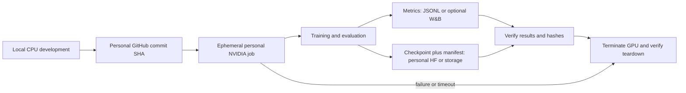
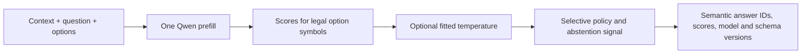

# Reflex v0.1 research and execution plan

**Date:** 2026-10-04

**Status:** Research-only. No Reflex model run, benchmark, or compute spend has occurred.

**Purpose:** Decide whether a small model can make useful runtime-defined decisions in one forward pass, and whether Reflex can demonstrate a defensible contribution against existing decision models.

## 1. Research question and evidence boundary

The initial question is not whether one can read candidate logits from a language model. It is whether that approach, or a carefully chosen alternative, delivers reproducible quality, robustness, uncertainty handling, latency, or cost improvements for previously unseen decisions when compared with today's closest systems.

First-party sources checked 2026-10-04 show that **Intern-Decision-0.8B** already performs runtime-schema candidate scoring at JSON placeholders in one calibrated Qwen3.5 pass, while **Kev-0.8B** uses a learned pointer head over the same Qwen3.5-0.8B-Base family and reports calibration, family holdouts, and order sensitivity. One-pass scoring, runtime schemas, calibration, and family holdouts are not novelty claims by themselves. Compare exact public checkpoints on a preregistered shared suite before Reflex training. Attribute published numbers to their authors; they are not Reflex measurements.

No result belongs in the README as a model claim until it has a reproducible run manifest, pinned model/data revisions, disclosed split, and measurements. Poor base-model zero-shot results do not refute the trained approach. Teacher self-reported confidence is not ground truth. A base checkpoint's pretraining contamination cannot be ruled out; “unseen” means unseen by Reflex post-training unless stronger evidence exists.

## 2. Proposed v0.1 scope and interface

Keep the first version English text and single-label: one mutually exclusive answer from 2–16 options supplied with each request. Binary is the two-option case. Support a 2,048-token input limit initially; reject oversized requests with a typed error rather than silently truncating. Use 4,096-token inputs only as a later stress test. Every option has a stable semantic ID, label and optional description. The answer returned to callers is the semantic ID, never “A” or “B” alone.

Include an explicit epistemic abstention result with `abstained`, a constrained reason, and nullable answer. Keep it distinct from a task's semantic “unknown,” “none,” or “insufficient evidence” category, which may itself be a valid option. Candidate probabilities are normalized over the supplied legal options; they must not be described as correctness probabilities until calibrated and evaluated for that interpretation. The stable output contract should carry option IDs, logits, probabilities (when requested), calibration version, abstention state/reason, model revision, and schema hash.

Defer multi-label output, ranking, scalar scoring, arbitrary option counts, RL, 4B scaling, and serving optimizations. Do not assert “arbitrary number of options”: the initial path is explicitly capped at 16. If a later task needs more options, evaluate a trained dynamic pointer head with per-request candidate masking or defer that task. Do not describe a reduced Banking77 or similar slice as the full benchmark.

## 3. Checkpoint and inference hypothesis

The preferred checkpoint is `Qwen/Qwen3.5-0.8B-Base`, Apache-2.0, revision `dc7cdfe2ee4154fa7e30f5b51ca41bfa40174e68`. Its reported 873,438,784 parameters include vision; call it the 0.8B family, not the exact text-model count. The text config is dense (not MoE): hidden size 1,024, 24 layers (18 GatedDeltaNet, 6 full attention), tied embeddings, vocabulary 248,320. See [checkpoint config](https://huggingface.co/Qwen/Qwen3.5-0.8B-Base/blob/main/config.json) and [Transformers docs](https://huggingface.co/docs/transformers/model_doc/qwen3_5).

First prove the checkpoint's text-only causal path loads all intended pretrained weights without unexplained missing or uninitialized keys. Transformers documents a `Qwen3_5ForCausalLM`/`Qwen3_5TextConfig` route; the published config's development Transformers version (`4.57`) is not a minimum compatible pin. Pin Python, PyTorch, CUDA, Transformers, PEFT, tokenizer and container revisions only after a remote compatibility smoke. Confirm intended causal-convolution/Flash Linear Attention kernels work, or report the fallback.

First implement baseline adapters, not a new model: Intern reads symbol logits before placeholders in an assistant JSON skeleton; Kev's pointer head compares each option closing-token state to the final question state. A simple final-token symbol scorer is an ablation, not a new contribution.

For the symbol-scoring control, serialize context, question and options; append a decision marker; prefill once; gather each row's final real token; score verified single-token symbols; normalize over valid options only. Check token IDs at the concatenated prompt boundary, preserve semantic IDs under shuffling, and compare native output projection with candidate-only weight-row projection within documented numerical tolerance. This path needs no generated reasoning or JSON.

Compare raw scoring against the official template on development data and evaluate abstention separately. Weak zero-shot results from a base checkpoint do not disprove supervised tuning.

The hybrid recurrent/convolution and full-attention architecture makes shared-prefix caching a later systems question. A conventional KV slice is not enough if recurrent/convolution state must also be forked for each suffix. Require state isolation and cached-versus-uncached equivalence before optimizing. A pointer head that compares a final query state with option marker states is a hypothesis requiring training and measurement; one pass does not guarantee invariance. Batched NLI scoring still has O(K) option-pair work even when requests are batched.

## 4. Data, splits, and leakage controls

Build split manifests before large-scale training. Each record needs the task, options, answer, source/family IDs, provenance, and license. Keep recipes/manifests in Git; exclude downloaded datasets, generated bulk data, and checkpoints. Tasksource indexes 600+ datasets and typed recasts, but its license filter is only a first pass: check original cards and teacher terms. Its [typed-decision recast](https://huggingface.co/datasets/tasksource/tasksource-jev-typed-decisions) already includes option shuffling, source/split tracking, and train/evaluation dedupe. Use [Natural Instructions](https://github.com/allenai/natural-instructions) cross-task split resources where applicable.

Split by original task/source family before recasts, paraphrases, or synthetic variants are created. Maintain separate train, development, calibration, and sealed test task pools. Report **held-out datasets**, **held-out domains**, and **held-out task families** separately: for example, testing Banking77 after training on CLINC is a new dataset within the same intent-classification family, not evidence of an unseen family. Deduplicate across Tasksource, SuperNI, and derived variants by source identity and text similarity, and record the dedupe method. Never use test labels to select prompts, train, fit temperatures, choose abstention thresholds, or choose a model. Fit a global calibration transform and select thresholds on distinct calibration/development task pools; if fitting per-target-task parameters, mark that result as adapted and report separately. A final sealed test is evaluated once after freezing recipe, calibration, thresholds, and model revision.

Start with audited hard labels. Treat teacher distributions as supervision, not truth; require provenance and a calibration pilot before soft targets. Teachers must not see sealed test items/templates. Record scenario, question, options, label, ambiguity and provenance; prefer diverse samples over large synthetic volume. Check redistribution rights for data and weights source by source.

## 5. Evaluation and baselines

Freeze metrics and acceptance thresholds before each run. At minimum report per-dataset accuracy and macro-F1, average metrics across datasets (not pooled-row accuracy alone), task/source-group bootstrap intervals, NLL, Brier score, reliability plots, and ECE by option count and task family. ECE is not a sole calibration criterion. For option robustness, report semantic answer flip rate after remapping shuffled options and score-distribution divergence such as Jensen–Shannon divergence; enumerate permutations for small K and sample ten for larger K. Report risk-coverage/AURC and error-detection for abstention, plus ambiguity and no-valid-option subsets. Choose deployment thresholds from calibration/development only. A sealed-test sweep is descriptive, not a way to tune thresholds; report risk at the frozen threshold with confidence intervals. Specify ties, malformed schemas, and zero-valid-option behavior. Temperature scaling can help on similar data but cannot fix order bias or guarantee transfer under shift. References: [Guo et al., 2017](https://proceedings.mlr.press/v70/guo17a.html), [Ovadia et al., 2019](https://arxiv.org/abs/1906.02530).

Prior-art comparison, based on first-party model cards, repositories, and docs checked 2026-10-04:

| System | Availability | What it demonstrates and current limit |
|---|---|---|
| [Intern-Decision-0.8B](https://huggingface.co/internlm/Intern-Decision-0.8B) | Public, Apache-2.0 | Qwen3.5; typed schema, one-pass candidate logits at JSON placeholders, calibrated. Preserve option order; no invariance or explicit OOD abstention result located. |
| [Kev-0.8B](https://huggingface.co/jaredpalmer/kev-0.8b) | Public, Apache-2.0 | Same Qwen base with LoRA and pointer head; family tests. Order sensitivity reported; shipped temperature uses training-corpus dev, heldout refit helps OOD but hurts trained families; no explicit abstain head. |
| [Jev](https://typesafe.ai/blog/introducing-system-one-models-and-jev) | Hosted early access | Typed `choice`, `score`, `noul` API; sources disclose neither public weights nor size. |
| [GLiClass](https://github.com/Knowledgator/GLiClass) | Public, Apache-2.0 | Dynamic-label single-pass classification; not a typed calibrated decision API. |
| [GLiNER2.5-Decide](https://huggingface.co/fastino/GLiNER2.5-Decide) | Public, Apache-2.0 | Runtime labels, one-pass specialist classifier; reviewed sources lack calibration, abstention, family, and permutation results. |
| [Laya](https://huggingface.co/convaiinnovations/laya) | Public, Apache-2.0 | 421M ModernBERT typed decisions; card reports confident multilingual errors and weak high-cardinality behavior. |
| [Tev1-0.8B](https://huggingface.co/togethercomputer/Tev1-0.8B-experimental) | Public checkpoint; weight license unresolved | Qwen3.5 SFT with constrained autoregressive output; defer pending license clarification. |

Start with majority/random, untuned Qwen base, and exact Intern/Kev revisions using their official paths, then a matched 2–16-option text slice. Add same-size instruct Qwen with constrained one-token output, a larger prompted model, and prose/CoT-style LLM; disclose output budget, latency, and cost. Candidate scoring and constrained one-token generation share nearly the same prompt prefill, so skipping `generate()`/JSON alone does not guarantee an order-of-magnitude speedup. A gain must come from model size, shorter input, batching, proven caching, or quality at equal cost. One pass still processes every input token. NLI, embedding matching, GLiClass, and GLiNER are zero-shot baselines; vanilla ModernBERT with a fixed supervised head is a separate track. Record failed reproductions and causes.

The defensible hypothesis is narrower: a Qwen3.5-0.8B-Base recipe may improve semantic option-order stability and selective risk/coverage on untouched task families under a preregistered paired protocol and disjoint calibration split. Tasksource already randomizes option order; neither shuffling nor testing permutation alone is novel. A measured improvement or an honest comparative study is the possible contribution. Keep published results attributed to their authors; do not reuse their benchmark or latency tables as Reflex measurements.

Measure each baseline on the same GPU, precision, K, prompt lengths, and batch sizes 1, 8, and 32. Separate cold startup, tokenization, warm p50/p95, throughput, VRAM/RAM, and experiment wall time. No Reflex latency or cost result exists. At full utilization, cost per million is `hourly_rate / (3600 * decisions_per_second) * 1,000,000`; also report realistic utilization and startup/storage overhead.

## 6. Staged execution plan and gates

**Stage 0 — finish research and freeze the test design (current; $0 compute).** Verify source links and licenses, publish ADR, define schema/split registry, choose baseline revisions, and preregister one matched benchmark slice. Gate: close prior art is understood well enough to state a falsifiable gap or decide the project is a comparative study. No model training or API generation.

**Stage 1 — CPU contract plus remote compatibility/score smoke (proposed cap: $20).** Implement schema, input rejection, token-boundary, semantic mapping, permutation, padding, and single/batch parity checks. On a personal ephemeral NVIDIA GPU verify full checkpoint loading, finite normalized scores, official-template behavior, and intended kernels or fallback. This stage is inference/compatibility only; no experimental training. Cap the smoke at two GPU hours and $20 total, and stop on correctness failure. Upload a minimal manifest, back up any artifact, and verify provider-side teardown; process exit alone does not stop a job. **This plan does not authorize account creation or spending.**

**Stage 2 — prior-art baseline and training proof (proposed within $60 supervised/baseline envelope).** First compare exact Intern and Kev checkpoints. Use roughly 10–30 audited tasks if evidence supports that suite; 50–200-family expansion is later. Train only if a gap remains: first overfit an audited 64–128-example slice, then at most ~1,000 examples/100–500 updates across 5–10 datasets. Start BF16 LoRA, microbatch 1, gradient accumulation, and activation checkpointing only if needed. Check adapters attach to intended attention/MLP modules; record trainable counts, gradients, and masked candidate cross-entropy with shuffled options. Gate: at least 95% on the clean, unambiguous 64-example diagnostic, with verified semantic remapping. This is not an evaluation claim.

**Stage 3 — controlled ablations (remaining supervised/data allocation).** Compare supervised-only, diverse data, option shuffling, then hard synthetic data. Try teacher KL only after hard-label/provenance review; add consistency loss only if shuffle training leaves measured order bias. Change one factor at a time across 4–6 runs. +3 macro-F1 over untuned base is only a learning signal. Before ablations, preregister the target and tolerance against Intern/Kev at comparable quality and compute; require that improvement (or a compelling Pareto result) and confirm promising results with a second seed.

**Stage 4 — calibration and release decision.** Fit calibration and choose abstention thresholds on their held-out calibration/development pools. Freeze model and recipe, then evaluate sealed test once. If unknown/no-valid-option evidence is weak, limit the claim. Release only reproducible results with licenses and limitations; a negative result is acceptable.

Vendor pricing and lifecycle docs checked 2026-10-04 show Modal A10 24GB at $1.1016/GPU-hour, about $2.20 for two GPU hours before CPU, memory, storage, and other billable time. Modal is the preferred first runner for ephemeral job/timeout controls; this is an operational choice, not proof of model compatibility. Alternatives include RunPod Secure 4090 ($0.74/hour) or A6000 ($0.53/hour), and Lambda A10/A6000 ($1.29/$1.09 per GPU-hour). Rates are point-in-time list prices; recheck availability and launch pricing. See [Modal pricing](https://modal.com/pricing), [budgets and spend limits](https://modal.com/docs/guide/budgets), [timeouts](https://modal.com/docs/guide/timeouts), [billing](https://modal.com/docs/guide/billing), [Volumes](https://modal.com/docs/guide/volumes), [RunPod pricing](https://www.runpod.io/pricing), [RunPod billing](https://docs.runpod.io/pods/pricing), and [Lambda instances](https://lambda.ai/instances). These are GPU-only planning snapshots, not quotes or authorization.

For a first Modal smoke use one container, zero retries, no always-warm worker, explicit startup/per-attempt timeouts, and short scaledown. Set a $20 workspace usage budget (gross before credits), distinct from the spend limit on out-of-pocket cost after credits. Billing includes load/execution and the default 60-second idle grace; scale-to-zero stops compute charges but storage remains. Commit volume changes and back up artifacts; deleted data may stay billable up to four days. A payment method is required. Starter advertises $30 monthly compute credits subject to eligibility; storage/egress have separate terms. Verify caps and teardown through the provider control plane. RunPod stop releases the GPU but attached pod disk continues billing; termination removes the pod. No account was created or compute launched during this research session.

The rough project schedule of 4–6 part-time weeks is illustrative and depends on available time; it is not a deadline. Proposed total planning envelope is $300, not an estimate proven by a run or approval to spend: $20 smoke, $60 supervised/baseline, $60 data/distillation GPU, $50 robustness/final GPU, $50 teacher/external APIs, $20 storage, and $40 reserve. Core v0.1 excludes 4B scale; defer it unless the 0.8B result and remaining budget justify it.

## 7. Remote workflow and repository shape

Keep the local computer a control plane. Proposed flow:

Use personal GitHub, GPU, Hugging Face, storage, keys and billing only. Keep source/config/split manifests in Git; use remote persistent storage for checkpoints and run artifacts, verify hashes and back them up before teardown. Start on-demand; consider spot only after recovery is proven. Add an external stop control so a crashed runner cannot leave an idle pod. No always-on endpoint is in scope. Use optional W&B or versioned JSONL, and verify current terms before account setup.

PyPI already uses the name `reflex` for a Python web framework ([project](https://pypi.org/project/reflex/), [repository](https://github.com/reflex-dev/reflex)); do not install it as this project's dependency. Keep Reflex as the project/repository name and consider distribution `reflex-decisions` with import `reflex_decisions` after availability is checked.

Proposed minimal layout: `src/reflex_decisions/{schema,rendering,backends/qwen,scoring}`, `training/{train,losses}`, `evaluation/{runner,metrics,splits}`, `configs/`, `data/recipes/` (manifests, not corpora), `tests/`, `docs/`, and `scripts/remote/`. CPU CI should run lint/typecheck/unit tests; GPU integration is a manual job with no leaked credentials. Keep the public API to the v0.1 decision contract.

The intended scoring path is:

## 8. Open inputs and immediate next action

The approved GitHub destination is the private personal repository `1337mus/reflex`. Modal and Hugging Face accounts can be created later: CPU schema, tests, dataset manifests, and evaluation adapters do not require them. Modal is needed before the first remote GPU job; a Hugging Face account is needed for checkpoint uploads or gated/private resources, while public ungated downloads can generally be anonymous. Confirm the proposed first $20 tranche before remote execution. Do not request keys in chat; use provider secrets. Optional inputs are 10–20 non-proprietary hard examples, first 2–3 domains, and weekly time budget.

Immediate next action is to freeze a matched text-only protocol from the cited model cards/provider docs and create CPU adapters/schema and split registry for Intern and Kev. Once account/budget inputs are confirmed, a bounded remote baseline job can establish whether a gap remains. This research session performed no account creation or spending; do not start Reflex training or large synthetic generation before that baseline gate.

## Sources

- [Qwen3.5-0.8B-Base config and revision](https://huggingface.co/Qwen/Qwen3.5-0.8B-Base/blob/main/config.json)
- [Transformers Qwen3.5 model documentation](https://huggingface.co/docs/transformers/model_doc/qwen3_5)
- [Tasksource dataset discovery/recasts](https://github.com/sileod/tasksource)
- [Tasksource typed-decision recast](https://huggingface.co/datasets/tasksource/tasksource-jev-typed-decisions)
- [Natural Instructions official split resources](https://github.com/allenai/natural-instructions)
- [Intern-Decision-0.8B model card](https://huggingface.co/internlm/Intern-Decision-0.8B)
- [Kev-0.8B model card](https://huggingface.co/jaredpalmer/kev-0.8b)
- [GLiClass](https://github.com/Knowledgator/GLiClass) and [GLiNER2.5-Decide](https://huggingface.co/fastino/GLiNER2.5-Decide)
- [On Calibration of Modern Neural Networks (temperature scaling)](https://proceedings.mlr.press/v70/guo17a.html)
- [Can You Trust Your Model's Uncertainty? Evaluating Predictive Uncertainty Under Dataset Shift (Ovadia et al., 2019)](https://arxiv.org/abs/1906.02530)
