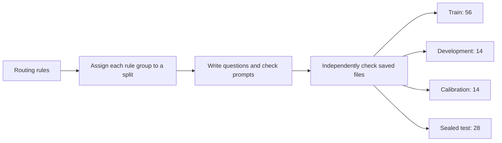

# Support-routing pilot data

The reviewed generator produced the support-routing dataset. Generation and independent data checks passed. No model has been trained or scored on this new dataset.

| Split | Questions | Purpose |
|---|---:|---|
| Train | 56 | Learn the routing patterns |
| Development | 14 | Tune the approach |
| Calibration | 14 | Check confidence and thresholds |
| Sealed test | 28 | One final check after choices are set |
| **Total** | **112** | |

## Generator and review

Each request has four attributes. Each has two allowed values. Three attributes left too few distinct rule tables for some split assignments. The review also found that menu size could reveal the result for questions with two missing values. The corrected generator uses the larger rule table and varies menu size independently of the result.

The correction passed its toy-seed checks: seeds 4, 7, and the maximum supported seed now generate 112 distinct structures each; an expanded 448-row toy run also passed. The first 63 toy training rows covered all nine menu-size and two-missing-outcome combinations. These were generator checks, not release evaluation.

The [generator source commit](https://github.com/1337mus/reflex/commit/3cf6db24fe75e2364a537c79d2c744fd1e78fd44) and [audit source commit](https://github.com/1337mus/reflex/commit/f11fe641a183ddf755b800752abced0bb00dda71) each passed exact-commit [CI](https://github.com/1337mus/reflex/actions/runs/37287866796) ([audit CI](https://github.com/1337mus/reflex/actions/runs/37287842621)). The clean-source check also passed 591 tests, Ruff, formatting, Mypy, and the existing CLI checks.

## Release checks

One fresh seed was selected after source review and exact-commit CI; no seed search was used. Generation ran with Python 3.12.13 and seed `9104251840560150670`.

| Independent release check | Result |
|---|---:|
| Rows across all splits | 112 |
| Distinct rule groups | 112 |
| Cross-split equivalent rule tables | 0 |
| Answers matching a separate recount from rendered prompts | 112 of 112 |
| Pinned source files matching their hashes | 11 of 11 |

For training questions with two missing values, the data covers eight of the nine possible pairings of menu size (4, 6, or 8 choices) and result (route, no route, or insufficient information). Each menu size has at least two results, so menu size alone does not give away the result. This describes the generated examples; it does not show how a model performs.

The 28-question sealed set is a small final check. It cannot establish broad superiority or performance across many kinds of routing tasks. Keep its prompts and answers sealed until the approach and thresholds are fixed.

Complete verifier, receipt, and export hashes are in the [verification summary](verification/routing-data-summary.json); the tracked [release recipe](../data/training/routing-v1-recipe.json) records the source pins.

Next, complete and verify the tool-choice data. A matched study comes later and must use equal presentations and update counts: replace repeated existing practice with new-family examples in treatment while the continued-training control keeps existing practice, and include retention results. The current dataset alone supports no training-effect claim.
