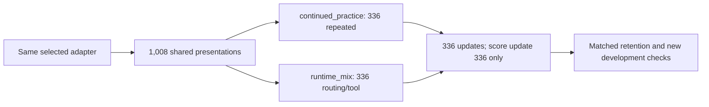

# Runtime-rule continued-training protocol

**Protocol identity:** `runtime-rules-v1`  
**Status:** accepted design; implementation, payload, and launch are still pending.

## Purpose and scope

Compare one fixed replacement recipe with continued practice. Both arms start from the same selected `snli_mix` adapter at update 378, use a fresh optimizer, receive the same shared presentations, and perform the same number of updates.

The treatment replaces 336 repeated-practice presentations with routing and tool-choice practice. This estimates the effect of the full replacement recipe. It does not isolate data quality, domain novelty, option-order augmentation, token exposure, or record diversity.

This is a one-seed engineering study, not a broad capability claim. No training or scoring run has started. The full protocol must be frozen before the payload is pinned.

## Arms and training budget

| Arm | Extra 336 presentations | Starting state and optimizer |
| --- | --- | --- |
| `continued_practice` | Repeat the first 112 presentations of each shared stream | Selected `snli_mix` update 378; fresh AdamW |
| `runtime_mix` | Routing and tool-choice training records, alternating families across three epochs | Same selected adapter; fresh AdamW |

Each arm receives 1,008 shared presentations plus 336 arm-specific presentations: 1,344 total and 336 updates. Each update is exactly four sequential microbatches in this order: `[real[i], old_synthetic[i], SNLI[i], extra[i]]`. The first three slots are shared between arms. A loss is divided by four before backward; clip once at 1 before each optimizer step.

Save update 168 without scoring it. Score update 336 only. Do not select a checkpoint by interim results. Each training arm is budgeted for at most 3,600 seconds.

| Forward work | Count |
| --- | ---: |
| Training: 336 updates × 4 microbatches × 2 arms | 2,688 |
| Seven retention tasks | 7,564 |
| New development, both arms | 328 |
| Unchanged selected adapter, new development only | 164 |
| Reload parity, both arms | 64 |
| **Maximum total** | **10,808** |

Final evaluation is 3,946 presentations per trained arm: 3,782 retention plus 164 new development. The unchanged adapter scores only the 164 new-development presentations. At 2,048 tokens each, the maximum input budget is 22,134,784 tokens. Saving update 168 adds no forwards.

## Evaluation panels

Reuse the selected adapter’s saved outputs for five existing retention tasks and its adapter-transfer outputs for BoolQ and COPA. Do not substitute historical base or control outputs. Require complete, duplicate-free joins and exact presentation identity before reuse.

| Retention task | Presentations |
| --- | ---: |
| DBpedia14 | 1,568 |
| SMS | 120 |
| Balanced SNLI | 1,152 |
| Synthetic fact | 450 |
| Synthetic numeric | 364 |
| BoolQ, original and reversed orders | 64 |
| COPA, original and reversed orders | 64 |
| **Total per arm** | **3,782** |

New development has 14 routing and 14 tool-choice records, with every cyclic menu rotation. Each family has five 4-option, five 6-option, and four 8-option records: 82 presentations per family. Keep the family panels separate and label-free. The unchanged selected adapter is scored on these 164 new-development presentations only; do not create a fresh-base comparison.

For reload parity, select the first 16 new-development presentations per family after sorting by `(record_id, order_index)`. This is 32 presentations per arm. Compare the loaded final adapter with its saved final outputs. Require exact tensor, winner, prompt, and tokenization agreement, with maximum absolute score difference at most `1e-3`.

New calibration and test files must not be uploaded, mounted, read, or scored. Developer integrity checks for the releases are already complete. Do not mount the full processed-data directory. Keep labels CPU-side and send request-only evaluation payloads.

## Scoring and decision gates

For each record, average correctness across its fixed presentation orders. Average records equally within each source group, then groups equally within each task. Routing and tool choice each form one task. Average their two task scores equally. Do not gate on raw correct/164; menu sizes differ.

| Contrast | Required gate |
| --- | --- |
| `runtime_mix` − `continued_practice`, new-family macro | Gain at least 5 percentage points; paired-bootstrap lower bound above 0; neither family loses accuracy |
| `runtime_mix` − unchanged selected adapter, new-family macro | Gain at least 5 percentage points; neither family loses accuracy; report intervals without a positive-lower-bound gate |
| Each of seven retention tasks, `runtime_mix` − `continued_practice` | Lose no more than 5 percentage points under the group metric |
| Each of seven retention tasks, `runtime_mix` − unchanged selected adapter | Lose no more than 5 percentage points under the group metric |

Compare exact fractions: five percentage points is `1/20`, not a relative five-percent change.

Original-order scores are descriptive. Report every component, interval, and failed gate. Do not remove a task, change a threshold, or alter the panel after seeing scores. These gates are engineering checks, not simultaneous statistical proof of noninferiority.

Use 2,000 paired bootstrap draws with seed `20266010`, sorted group IDs, and type-7 percentiles. Keep the 14 routing and 14 tool-choice groups in separate strata. Average their group means equally in each draw. Reuse the same fixed resample indices across contrasts.

Use one `random.Random(20266010)` generator. Build all 2,000 samples for each task in this fixed order: routing, tool choice, DBpedia14, SMS, balanced SNLI, synthetic fact, synthetic numeric, BoolQ, COPA. Each sample draws that task's group count with replacement. Pair the same sample index across the two new families when computing their macro score.

## Frozen inputs and identities

| Component | Frozen identity |
| --- | --- |
| Base | `Qwen/Qwen3.5-0.8B-Base`, revision `dc7cdfe2ee4154fa7e30f5b51ca41bfa40174e68`; frozen BF16 base |
| Adapter | Natural-reasoning R1, `snli_mix`, update 378; FP32 LoRA, rank 8, alpha 16, dropout 0 |
| Adapter selection | Use the pinned [selection record](https://github.com/1337mus/reflex/blob/f53ac8ce986fb4c43ea82d6b5a28875603c529bb/data/evaluations/adapter-transfer-v1-selection.json) and verify its selected snapshot files and canonical tensor digest |
| Input ceiling | 2,048 tokens; reject overlong requests without truncation or dropping rows |

The snapshot is `/artifacts/runs/natural-reasoning-2026-10-04-r1-snli/adapter-update-378`. The selection record binds its training receipt, analysis, agreement, and storage verification. The [natural-reasoning summary](https://github.com/1337mus/reflex/blob/f53ac8ce986fb4c43ea82d6b5a28875603c529bb/docs/verification/natural-reasoning-summary.json) and [adapter-transfer summary](https://github.com/1337mus/reflex/blob/f53ac8ce986fb4c43ea82d6b5a28875603c529bb/docs/verification/adapter-transfer-summary.json) are pinned at that immutable commit.

The release inputs are pinned by the [routing verification summary](https://github.com/1337mus/reflex/blob/f53ac8ce986fb4c43ea82d6b5a28875603c529bb/docs/verification/routing-data-summary.json), [routing recipe](https://github.com/1337mus/reflex/blob/f53ac8ce986fb4c43ea82d6b5a28875603c529bb/data/training/routing-v1-recipe.json), [tool-choice verification summary](https://github.com/1337mus/reflex/blob/f53ac8ce986fb4c43ea82d6b5a28875603c529bb/docs/verification/tool-data-summary.json), and [tool-choice recipe](https://github.com/1337mus/reflex/blob/f53ac8ce986fb4c43ea82d6b5a28875603c529bb/data/training/tool-v1-recipe.json). The runtime, dtype, source revision, tokenization, prompt, ordered options, and exact snapshot digest must be identical where required and included in each output identity. `request_hash` alone is insufficient because it sorts options. Fix the full payload and schedule hashes before launch.

The study consumes only the training and development pools from those releases. Exclude calibration/test files from the payload and mounts; do not read or score them.

## Execution contract

Sort complete input pools by record ID before calling `epoch_examples`. Use these fixed streams and seeds:

| Stream | Seed or epochs |
| --- | --- |
| Real | `20261010` |
| Old synthetic | `20262010` |
| SNLI | `20263010` |
| Routing extra | seed `20264010`, epochs 0, 1, 2 |
| Tool-choice extra | seed `20265010`, epochs 0, 1, 2 |
| Python and Torch training RNG | `20261009` |

The sorted complete shared source pools contain 504 real, 500 old-synthetic, and 500 SNLI records. For each shared stream, sort the full pool by record ID, call `epoch_examples` with its fixed seed for epoch 0, and take the first 336 epoch-0 examples. Each new-data train pool has 56 records per family. Call `epoch_examples` for each family in epochs 0, 1, and 2 and consume those deterministic examples in order, so every new record is used once per epoch. The control extra stream is `extra[3j:3j+3] = [real[j], old_synthetic[j], SNLI[j]]` for `j=0..111`. The treatment alternates routing and tool-choice examples while consuming each deterministic epoch in order. Hash full ordered schedules, record IDs, option orders, gold mappings, source groups, and token exposure before launch.

Use a new study contract and runner. Do not call the old high-level training runner unchanged: it binds the historical 378-update schedule and `1e-4` learning rate. Reuse suitable low-level functions only. Pin the nine runtime package versions from [`experiments/mixture_training_contracts.py`](https://github.com/1337mus/reflex/blob/f53ac8ce986fb4c43ea82d6b5a28875603c529bb/experiments/mixture_training_contracts.py) at commit `f53ac8ce986fb4c43ea82d6b5a28875603c529bb`: torch `2.14.1+cu130`, torchvision `0.29.1+cu130`, transformers `5.18.0`, peft `0.21.0`, Pillow `12.0.0`, pydantic `2.13.5`, huggingface-hub `1.33.0`, tokenizers `0.23.2`, and safetensors `0.8.0`. Keep both historical source allowlists unchanged; the new source allowlist must preserve all 60 adapter-transfer fingerprint paths and add the study-specific files and protocol.

Fresh AdamW: betas `(0.9, 0.999)`, epsilon `1e-8`, learning rate `5e-5`, weight decay `0`. Use final-step candidate-token cross-entropy. Freeze the base and target modules, tokenizer, candidate scoring, and tie policy. The maximum candidate score wins; exact ties select the lexicographically smallest option ID, matching the existing scorer. Independently verify each loaded FP32 LoRA’s keys, shapes, values, and canonical digest against the selected snapshot before creating the empty optimizer.

Before the first optimizer step, compile every scheduled training, evaluation, unchanged-adapter, and reload-parity request with the pinned tokenizer. Reject any input over 2,048 tokens; never truncate it or drop its row. Record per-request token counts in the frozen payload and execution receipts. Pin the exact reviewed source commit in the payload and require every arm and scoring worker to use it.

Every reused output join must verify full identity, exact order, prompt and tokenizer hashes, token counts, model/runtime/dtype/source identity, and snapshot digest. Preserve complete duplicate-free joins. Any missing or incompatible row blocks launch; do not silently rescore it or change the panel.

## Compute and launch boundary

Use two single-use A10 training workers, at most two concurrent, 3,600 seconds per arm. The unchanged-adapter worker is limited to 900 seconds and scores new development only. Freeze startup at 300 seconds, 2 CPU cores, 16 GiB RAM, minimum workers 0, warm workers 0, buffer 0, retries 0, single-use, and 2-second scale-down. Use the private `reflex-rehearsal-artifacts` volume. Choose the run ID only at execution. Use fresh exclusive artifact paths; never overwrite prior evidence.

Bounded personal compute is already authorized. Before launch, root must review the implementation, exact-commit CI must pass, and protocol, source pins, payload, and schedules must be fixed. Refresh the live account and budget snapshot immediately before launch and confirm remaining budget is adequate for a roughly USD 300 total target. This is a readiness check, not a cost cap. The 2026-10-05 09:55 UTC snapshot showed no active apps, USD 2.30634924 metered, and USD 0 billed; it is delayed and revisable, not a current budget check.

Run the unchanged-selected-adapter worker first, limited to the 164 new-development requests. Start the two training arms only after it completes; at most two GPUs may be active concurrently.

On any failed worker, parity check, or lifecycle check, preserve partial evidence and invalidate the pair. A failed unchanged-adapter worker prevents both training arms from starting. Do not automatically retry or recover by selecting a different checkpoint. No run ID has been assigned and no study run has started.

## Interpretation limits

The new data contributes 112 distinct training records, each presented three times. The control repeats 336 already-shared records once more. Menus and option permutations differ, so equal updates do not equalize tokens, unique records, difficulty, or compute time.

There are 28 new structural groups total, not 164 independent examples. Each new development family has only 14 groups and two multiple-missing cases; both cases agree across completions, and neither family has a multiple-missing disagreement case. The bootstrap is conditional on this small panel and one training seed. Previously inspected development panels, including SNLI used for adapter selection, are monitoring evidence, not fresh sealed-test results.

Report the small panels, limited multiple-missing coverage, one-seed design, and token-exposure difference. The 28-row release test splits remain sealed and unused. Do not search seeds or settings. This protocol does not promise a performance gain or establish broad reasoning ability.
