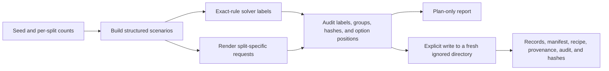

# Synthetic seed-data plan

This self-authored fixture corpus exercises Reflex's decision-record format, exact-label solvers, split lineage, and audit path before any model evaluation. It is not benchmark evidence and cannot support claims about generalization.

## Design

The default seed is `20261006`. Two task families receive 100 train, 25 development, and 25 calibration scenarios apiece:

- **Atomic fact inference:** each scenario lists three complete one-color facts and asks one entailed, one contradicted, and one unknown claim. An explicit statement defines the color of an unlisted object as unknown.
- **Numeric selection:** each scenario lists 2, 4, 8, or 16 named items with distinct exact integer values and asks for both the minimum and maximum. The option-count cycle runs independently of wording-template selection.

This produces 150 scenarios per family and 750 records total: 500 train, 125 development, and 125 calibration. Every scenario's derived questions share a source group and stay in its assigned split. Each split has two wording templates per family, with distinct rendered context and question wording. Names, values, IDs, and option order are deterministic from the seed and scenario coordinates.

Canonical scenario hashes cover the structured facts and claims or measurements and queries, excluding split names, wording templates, and opaque IDs. The generator rejects repeated canonical problems. Structured solver evidence lives in provenance; records contain only the request and answer ID. No split name, gold label, or problem hash is added to a model prompt.

Scenario indices use fixed split ranges (`split_index * 10,000 + local_index`). Increasing a split's count therefore preserves existing scenario IDs, source groups, canonical problems, and numeric option counts in every split.



## Limits

There is no test split and no held-out-family claim. These simple generated tasks check implementation and controlled behavior only. They do not establish model utility, calibration, robustness, or performance on real tasks. The split audit checks record, request, and source-group lineage; it is not semantic or pretraining-contamination analysis.

## Next teacher step

If a teacher is used later, the next step is a separate label-blind review for clarity and ambiguity. Give the reviewer rendered requests without gold labels or structured solver traces. Quarantine an entire source group if a reviewer flags ambiguity or the exact solver cannot establish one unique answer. Teachers may flag or explain a problem; they do not write or override synthetic labels. The exact solver remains ground truth only for fully specified cases with a unique answer.

## Reproduction

The command is plan-only unless `--write` is passed:

```sh
uv run --offline --cache-dir .cache/uv --locked python experiments/prepare_synthetic_data.py
uv run --offline --cache-dir .cache/uv --locked python experiments/prepare_synthetic_data.py --write --output-dir data/processed/synthetic-seed-v1
```

Writing requires a fresh output directory. The ignored generated directory contains records, manifest, recipe, scenario provenance, audit counts, and a report with per-file SHA-256 hashes. Choose another fresh directory to preserve a prior generation.

The reviewed candidate is `data/processed/synthetic-seed-v1-r2`. Its [verification receipt](verification/synthetic-seed-v1.json) pins the generated files and source. The earlier local candidate is retained as rejected review evidence; do not use it for training. No model has trained on this corpus yet.
