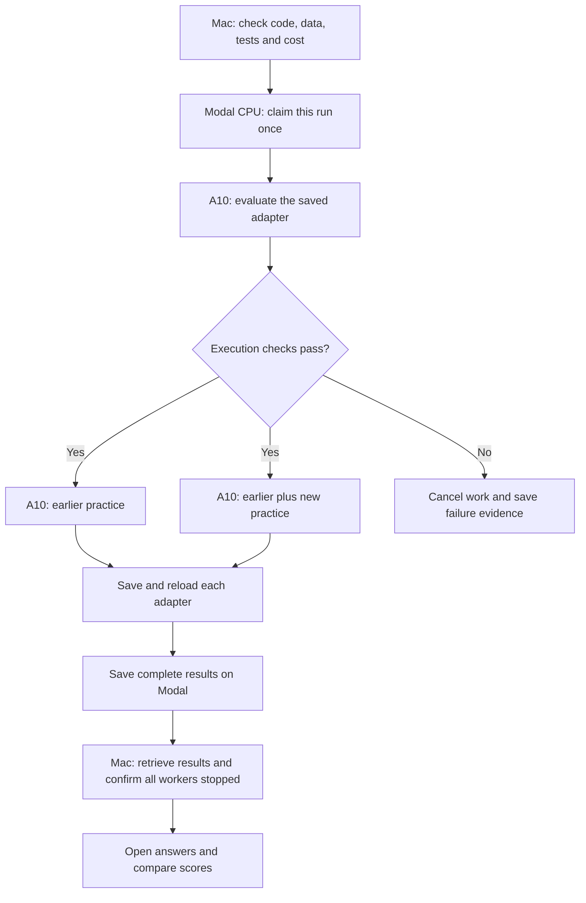

# Run training without keeping the Mac connected

The first targeted study stopped before training began. Its reference evaluation
finished, but the local launcher disappeared. The exact exit cause is unknown.
The [failure report](targeted-training-interruption.md) preserves that attempt.

The replacement run keeps the same questions, training recipe and success rules.
It gets a new run ID. A small CPU worker on Modal controls the whole sequence.
The Mac starts that worker and can then disconnect.

## What changes

| Part | Replacement behavior |
| --- | --- |
| Starting work | The Mac submits one remote CPU worker and saves the app ID. |
| Next training step | The remote worker decides when to start it. |
| Saved evidence | Modal storage holds progress, raw results and the final run record. |
| Duplicate protection | Each worker must claim its run and role before loading the model. |
| Reconnecting | Retrieve the existing run. Do not submit it again. |
| Opening test answers | Requires all three valid results and proof that every worker stopped. |

The CPU worker has one core, 4 GiB of memory and a 150-minute execution limit.
Its startup limit is five minutes. It has no GPU and no automatic user retries.
The existing GPU limits stay fixed: 30 minutes for the reference and 90 minutes
for each training arm, plus up to five minutes of startup per worker. Both arms
can train at the same time. There are no warm workers left running afterward.

These are time and resource limits, not a provider-enforced dollar cap. Refresh
rates and account usage before launch. Include the CPU worker in the estimate
and keep the replacement study within its existing $10 reserve.

## Failure and recovery

Ordinary retry settings do not establish that a cloud provider can never restart
a worker. An atomic claim blocks a second entry before model loading or training.
The claim store supports this check during execution. Its permanent retention
is not established. Persistent run markers and saved files remain the historical
record. Never reuse a run ID.

If a worker fails, cancel the other workers and save the failure evidence. Save
that evidence before requesting app shutdown, since shutdown can also stop the
CPU worker. A lost acknowledgement means the launch state is unknown. It does
not authorize submitting the work again.

Recovery reads saved files without starting a model or another CPU worker. It
checks the run, app, code and data identities. It then confirms that the app has
stopped with zero tasks. Missing evidence means the run has not passed. Reserved
answers and scores stay closed until all required checks pass.

## Verification before training

Run local failure tests, review the final code, and pass CI on the exact signed
source commit. Then run a small CPU-only disconnect rehearsal on Modal. It must
show that remote sequencing and saved evidence survive the local client's exit.
Only after that check may the replacement GPU study start.

The [training protocol](targeted-training-protocol.md) remains the source of truth
for learning, data and scoring. This document changes execution and recovery only.
