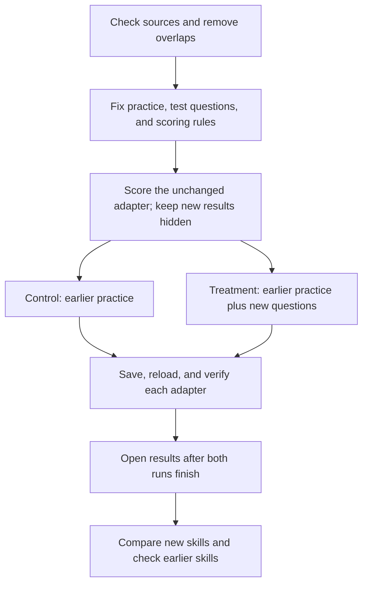

# Can new practice improve logic and commonsense?

**Study:** `targeted-reasoning-v1`  
**Plan fixed:** 2026-10-05, before selecting new questions or running a model.  
**Status:** Data and code preparation. No training has started.

The current adapter struggles with unsupported claims and commonsense questions.
This study tests whether targeted practice improves both skills. It also checks
whether earlier skills get worse. A passing result applies to this small study.
It does not establish broad reasoning ability.

## The comparison

All three versions start from the same saved adapter: `snli_mix`, update 378,
from `natural-reasoning-2026-10-04-r1`.

| Version | What changes |
| --- | --- |
| Unchanged reference | No extra training |
| Control | More of the earlier practice |
| Treatment | Replace one quarter of the control's practice with HANS and WinoGrande |

Both training arms receive **1,200 updates and 4,800 practice presentations**.
An update uses four examples in order: old real data, old synthetic data, old
SNLI data, and one extra example. Each contributes one quarter of the loss.
The same shared examples and answer orders appear in both arms.

The control's extra stream repeats earlier practice. The treatment's extra stream
alternates 600 HANS examples and 600 WinoGrande examples, using each once.
Matching updates and presentations does not match tokens, run time, or difficulty.
Record those differences.

## Practice and reserved questions

| Task | New practice | New reserved evaluation | Purpose |
| --- | ---: | ---: | --- |
| HANS | 600 | 300 | Decide whether a claim follows from a sentence |
| WinoGrande | 600 | 200 | Choose the intended word in a sentence |

HANS uses the training and evaluation files at
[`tommccoy1/hans@7299f6f657089ce06a0f98e7e81f8d0f5b7741ce`](https://github.com/tommccoy1/hans/tree/7299f6f657089ce06a0f98e7e81f8d0f5b7741ce).
The repository has an MIT notice; this is not a separate dataset-terms finding.
Its training and evaluation sets share all 60 template IDs. The study measures
learning within these templates, not transfer to unseen templates.

WinoGrande uses only `train_xl.jsonl`, `train_xl-labels.lst`, `dev.jsonl`, and
`dev-labels.lst` in the cached `winogrande_1.1.zip` archive. The downloader is pinned
to [`allenai/winogrande@727e837f77521ef38bcc56df3b275c8da43f45af`](https://github.com/allenai/winogrande/tree/727e837f77521ef38bcc56df3b275c8da43f45af).
The repository says CC-BY without a version; the archive README says CC BY 2.0.
The code's Apache-2.0 license is separate. Do not open the official test members.

| Source bytes | SHA-256 |
| --- | --- |
| HANS training file | `49245bd5fdb0b185dcbfbf48f0f16513c62ad5bc9fad0b8800dc48d6818ee5cf` |
| HANS evaluation file | `c55b62feef9913070e88f38938dc2492018c945ac81f70139346472494124e79` |
| WinoGrande archive | `3619ab104d8be2977b25c90ff420cb42d491707dcc75362a1e5d22bc082b7318` |

Normalize text with Unicode NFKC, case folding, and whitespace collapse.
Use these fixed exclusion rules before selection:

- **HANS:** Remove training premises found anywhere in official evaluation.
  Remove old training premises and exact sentence pairs from both new pools.
  Remove all premises implicated by conflicting labels for an exact sentence pair.
  Reserved premises must also differ from every old monitored HANS premise.
  Keep selected premises unique across subcases within each new pool. Select
  20 training and 10 reserved premises per subcase. Use subcases only for analysis
  groups; shared subcases do not count as duplicate questions.
- **WinoGrande:** Treat the unordered pair of normalized answer texts as an exclusion
  block. Remove every training block present anywhere in official development.
  Also exclude matching source IDs, exact sentences, and old training requests.
  Remove all blocks implicated by conflicting answers to the same normalized
  sentence and option set, across either source. Reserved blocks must differ from
  every old monitored WinoGrande block, ID, and sentence. Select one question per
  block. These are conservative exclusion blocks, not proven independent families.
- Check the selected training set against every approved evaluation request and
  record ID. Keep the seven earlier retention panels and the old 700-question
  monitoring panel exactly as they were. Do not change them based on new findings.

HANS IDs repeat across splits. Qualify them as `hans/train/{pairID}` and
`hans/evaluation/{pairID}`. Qualify WinoGrande IDs by `train_xl` or `dev`, but also
check its raw IDs across splits. Rank candidates by SHA-256 of
`targeted-reasoning-v1:20261013:{qualified_source_id}`, then by the qualified ID.
For HANS, process subcase names in sorted order and take the first eligible unused
premises. For WinoGrande, take the first eligible unused blocks in ranked order.
Do not use labels to rank questions. Stop if a quota cannot be filled.

The pre-selection audit found enough eligible data. HANS has at least 929 eligible
training premises and 989 reserve premises per subcase. WinoGrande has 7,102 eligible
training blocks and 630 reserve blocks. Its two conflicting exact-question groups
exclude two blocks from training and one of those blocks from the reserve pool.
HANS excludes 149 training rows whose premises appear in evaluation.

These checks detect exact normalized overlap. They do not rule out paraphrases or
base-model pretraining exposure. The new reserve is protected for this intervention;
it is not a private benchmark. No agent may inspect its question text, answers,
predictions, or scores before both fixed training arms finish. Programs may select,
validate, hash, and store it. Freeze all identities and schedules before scoring the
reference. A failed run does not authorize opening partial reserved results to tune
a replacement experiment. Existing project calibration and test pools stay closed.

## Fixed training recipe

Use `Qwen/Qwen3.5-0.8B-Base` at revision
`dc7cdfe2ee4154fa7e30f5b51ca41bfa40174e68`, with a frozen BF16 base and FP32 LoRA.
Verify the selected adapter's files and tensor digest before use:
`b9ade96b9f6077934985a4b261a6f7400a1e210003b02094b492f36c8a844324`.
Each arm loads an independent copy. LoRA rank 8, alpha 16, dropout 0, and its
60 modules remain fixed. No base-model parameter may receive a gradient.

| Setting | Fixed value |
| --- | --- |
| Optimizer | Fresh AdamW; empty starting state |
| Learning rate | 0.00005 |
| Betas / epsilon / weight decay | 0.9 and 0.999 / 0.00000001 / 0 |
| Gradient norm limit | 1.0, once per update |
| Training random seed | 20261014, same for both arms |
| Updates / examples per update | 1,200 / 4 |
| Checkpoint | Final update 1,200 only |

Sort each source pool by record ID. Use the existing `epoch_examples` shuffle.
Concatenate epochs starting at zero, then take the first 1,200 examples per shared
stream. Real, synthetic, and SNLI seeds are 20261114, 20261214, and 20261314.
The extra control stream interleaves the first 400 entries from each shared stream:
real[0], synthetic[0], SNLI[0], real[1], and so on.
The treatment alternates one 600-example HANS epoch with seed 20261414 and one
600-example WinoGrande epoch with seed 20261514. These shuffles also set answer order.

Use candidate cross-entropy loss divided by four for each example. Accumulate
gradients, clip once, then take one optimizer step. No scheduler, early stopping,
seed search, interim scoring, or checkpoint selection is allowed.

## Evaluation and success checks

Score the full panel again for each of the three states. Keep evaluation answers
on the CPU host. Only training-loss rows carry answers to a GPU worker.

| Panel, per model state | Presentations |
| --- | ---: |
| New HANS and WinoGrande reserve, two answer orders | 1,000 |
| Prior 700 public questions, two answer orders; monitoring only | 1,400 |
| DBpedia / SMS / balanced SNLI | 1,568 / 120 / 1,152 |
| Synthetic facts / numeric selection | 450 / 364 |
| BoolQ / COPA | 64 / 64 |
| **Total per state** | **6,182** |

The two new orders are original and one left rotation. First average all orders
within each question, then questions within each analysis group, then groups equally.
HANS has 30 subcase groups. Reserved WinoGrande has 200 single-question blocks.
Earlier panels retain their original analysis groups. Report raw correct counts
and original-order results too. Do not combine tasks into an overall reasoning score.

Every row below must pass. A gain on one task cannot cancel a failure on another.

| Check | Requirement |
| --- | --- |
| Each new reserved task | Treatment beats control by at least 5 percentage points; paired 95% interval has lower bound above zero |
| Each new reserved task | Treatment beats unchanged reference by at least 5 points |
| Each reserved HANS answer class | Treatment loses no more than 5 points against unchanged reference, across both orders |
| Each of seven earlier tasks and monitored ARC | Treatment loses no more than 5 points against control and against unchanged reference |

The retention limits use group-mean point estimates. They are practical checks,
not proof that forgetting is absent. HANS class checks use pooled two-order class
accuracy. Monitored HANS/WinoGrande and all original-order results are descriptive.

Use 2,000 paired group-bootstrap draws and type-7 2.5th/97.5th percentiles.
Initialize one `random.Random(20261015)`. Iterate dataset IDs and group IDs in sorted
order. For each dataset, draw its number of groups with replacement using
`rng.randrange` for every index. Share each draw across all states and contrasts:
treatment minus control, treatment minus unchanged, and control minus unchanged.
Display intervals per task. They are not simultaneous confidence intervals.
They reflect question/group sampling with one training seed, not training-seed
variation. The combined treatment cannot isolate HANS's effect from WinoGrande's.

## Execution limits

Use private personal `1337mus/reflex` and Modal profile `reflex-personal`, workspace
`rajath-61258`, environment `main`, SDK 1.6.1. Keep the laptop CPU-only.
Preserve historical source bytes. Sign source commits on `main` and pass CI on the
exact source commit before compute. Bind raw data, selected identities, schedules,
compiled prompts, tokenizer, source, adapter, and this protocol in the launch plan.

Score the reference first on one A10 with a read-only adapter volume. Check execution
without revealing reserved results. Then run the two training arms concurrently,
one A10 per arm. Use zero retries and one single-use container per role.

| Bound | Reference | Each training arm |
| --- | ---: | ---: |
| Function timeout | 1,800 seconds | 5,400 seconds |
| Startup timeout | 300 seconds | 300 seconds |
| CPU / memory | 2 cores / 16 GiB | 2 cores / 16 GiB |
| Training / evaluation / reload forwards | 0 / 6,182 / 0 | 4,800 / 6,182 / 32 |

Set minimum and buffer containers to zero and scale-down to two seconds. The total
is **28,210 forwards**, with at most **2,048 input tokens per forward** and an absolute
ceiling of **57,774,080 input tokens**. Compile every request before launch; reject
overlong requests without truncation or dropping. Record actual phase counts and tokens.

Save each trained adapter in a new exclusive run directory. Load it into a fresh
base and compare the first 32 retention presentations sorted by dataset, record,
order, and presentation ID. Reuse their final-score outputs as the pre-reload side.
Require exact saved tensor equality, equal requests and winners, and maximum score
difference at most 0.000001. No extra uncounted scoring calls.

Refresh usage and rates before launch against the roughly $300 flexible project
budget. Reserve $10 for this study, subject to that check. Listed timeout assumptions
sum to 13,500 worker-seconds; confirm provider semantics before estimating cost.
This reserve is not a provider-enforced spending cap.

Any failed worker, incomplete result, unknown in-flight forward, bad save/reload,
or invalid identity fails execution. Cancel remaining work and preserve evidence.
Do not retry automatically. Open reserved results only after all required execution
checks pass. Independently recount results, verify shutdown, and publish an honest
aggregate report to the private repository. Preserve all earlier failed results.
