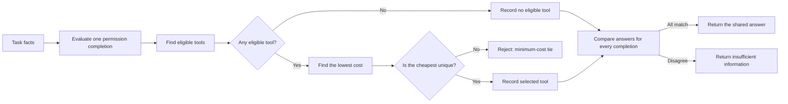

# Tool-choice foundation

The tool-choice foundation computes simulated answers from facts in each request. It does not call real tools. The signed, pushed [source commit](https://github.com/1337mus/reflex/commit/6b0dc56b5cc84f6e79357b91f2e5570f597b207c) passed independent review with no findings and exact-commit [CI](https://github.com/1337mus/reflex/actions/runs/37290214455).

For each possible value of unknown permissions, the program checks tool eligibility and picks the uniquely lowest-cost tool. If no tool qualifies, that completion answers “No eligible tool.” A lowest-cost tie rejects the scenario. Once every completion has an answer, matching answers yield the shared tool or no-tool result; disagreement yields “Insufficient information.”

| Check | Result |
|---|---:|
| Solver tests | 21 passed |
| Prompt and parser tests | 14 passed |
| Full suite | 626 passed |
| Ruff lint, formatting, Mypy, and both CLI checks | Passed |
| Exact-commit CI | Passed |
| Independent review | Passed; no findings; 60 historical source pins unchanged |

The independent review also checked 15,552 small solver cases and 1,024 prompt round trips. These checks support the simulated answer program and its text format; they do not measure model performance. Tool-choice data implementation is underway, but no tool-choice release dataset has been generated. No model was run on this foundation, and no model gain has been measured. See the [verification summary](verification/tool-choice-foundation-summary.json) for validation and source hashes.
