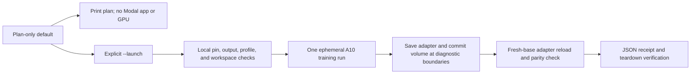

# Run the bounded training-mechanics rehearsal

This runbook describes the plan-only default and the separately guarded paid launch for the
self-authored fixture in `data/training/rehearsal-v1.jsonl`. The completed run and its limits
are recorded in the [results](training-rehearsal-results.md); the frozen procedure and resource
bounds are in the [protocol](training-rehearsal-protocol.md). This is a training-mechanics
check, not benchmark or generalization evidence.

The fixture contains 64 train-only records: 32 customer-support and 32 infrastructure routing
examples. COPA, BoolQ, and SNLI are not training inputs. The runner verifies the checked-in
records, manifest, protocol, and source pins before remote work.

## Plan without launching

From the repository root, the default command prints the bounded plan and returns. Without
`--launch`, it does not create a Modal app, load a model, or start compute.

```sh
UV_CACHE_DIR="$PWD/.cache/uv" UV_PYTHON_INSTALL_DIR="$PWD/.cache/python" \
  uv run --offline --locked python -m experiments.modal_train_rehearsal
```

Review the printed plan against the frozen protocol: 64 records, up to 128 optimizer updates,
512 training forwards, and 1,280 maximum total forwards. Training stops at the first diagnostic
with at least 95% fixture accuracy, but always completes at least 16 updates. The default
execution budget is one ephemeral A10, 2 CPU cores, 16 GiB memory, no warm/buffer containers,
no configured retries, a 300-second startup timeout, and a 1,800-second function timeout.
These limits do not set a dollar ceiling.



## Explicit paid launch

Only use `--launch` when intentionally starting a new paid run. The command requires a fresh,
unique run ID and a new local receipt path; an existing run ID or output is rejected. Replace
`r2` with the next unused run number if needed. The existing profile must resolve to workspace
`rajath-61258`. Keep provider credentials in the configured Modal profile; the runner rejects
credential environment overrides. The offline flag only prevents `uv` from downloading
missing Python packages; the launched process contacts Modal and the worker downloads the
public model revision anonymously.

```sh
mkdir -p artifacts
RUN_ID="training-rehearsal-$(date -u +%Y-%m-%d)-r2"
RUN_RECEIPT="artifacts/${RUN_ID}.json"

UV_CACHE_DIR="$PWD/.cache/uv" UV_PYTHON_INSTALL_DIR="$PWD/.cache/python" \
  uv run --offline --locked --with modal==1.6.1 python -m experiments.modal_train_rehearsal \
  --launch \
  --profile reflex-personal \
  --workspace rajath-61258 \
  --run-id "$RUN_ID" \
  --records data/training/rehearsal-v1.jsonl \
  --manifest data/training/rehearsal-v1-manifest.json \
  --output "$RUN_RECEIPT"
```

The runner returns a JSON receipt and artifact paths; model and adapter weights stay in the
personal Modal Volume. Check that the receipt says `status: passed`, that its data, protocol,
model, and source hashes match the reviewed inputs, and that its forward counts stay within
the stated caps. Separately verify the app is stopped with zero tasks and check provider
usage before reporting billing. Neither configured timeouts nor app lifetime proves a dollar
amount or model latency. This runbook documents the launch mechanism; it does not itself
authorize spending.
